1.  

[[In this tutorial I am going to explain to you how to create simple web
GIS application using Google Map API as map service and MySQL database
to store our data and PHP programming language.
]{lang="en-US"}]{lang="en-GB"}

[[I am using XAMPP Web Server which consist of Apache web server and
MySQL database server. You can use any web server that support a PHP.
]{lang="en-US"}]{lang="en-GB"}

1.  

[[We are going to create a simple database for hotels which used to
store the Name, Description, Phone, Email and Stars in addition to
Longitude and Latitude to store the geographical coordinates of the
hotel. ]{lang="en-US"}]{lang="en-GB"}

[[And the hotels data which include the longitude and latitude is
projected on the google map in web page.]{lang="en-US"}]{lang="en-GB"}

2.  

[[Open the XAMPP Control Panel and start the Apache web server and MySQL
database server.]{lang="en-US"}]{lang="en-GB"}

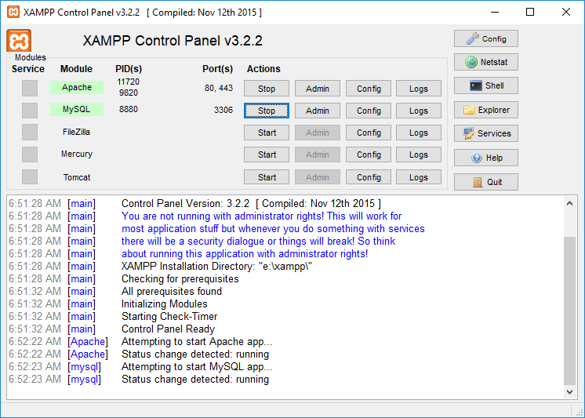{width="554" height="396"}

[[And then open your web browser and in the address bar write
\[http://localhost/\] and press enter. Click on
]{lang="en-US"}[**phpMyAdmin**]{lang="en-US"}[ link.
]{lang="en-US"}[**phpMyAdmin**]{lang="en-US"}[ is web based interface
for MySQL database.]{lang="en-US"}]{lang="en-GB"}

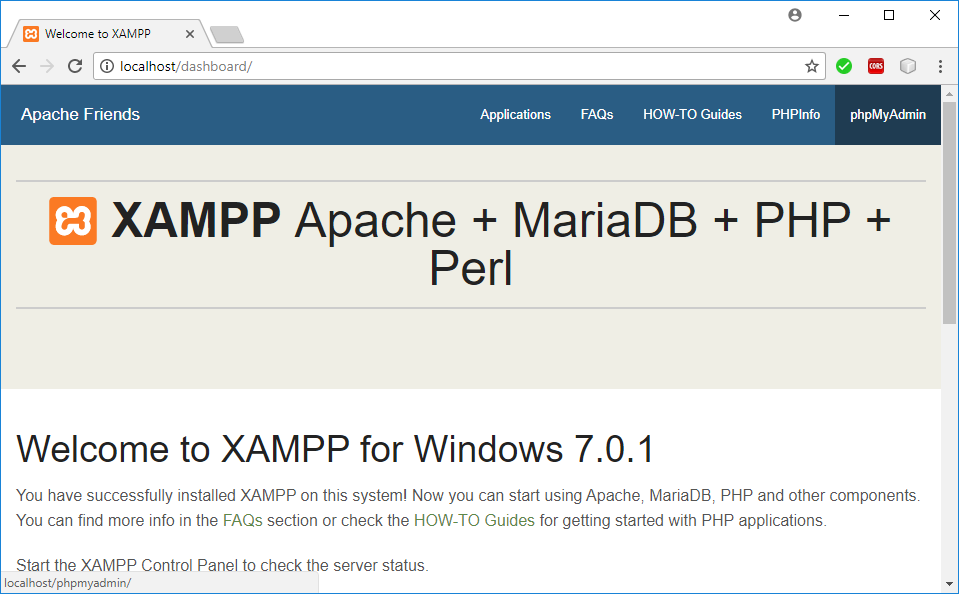{width="554" height="343"}

[[To create new database click on Databases
button.]{lang="en-US"}]{lang="en-GB"}

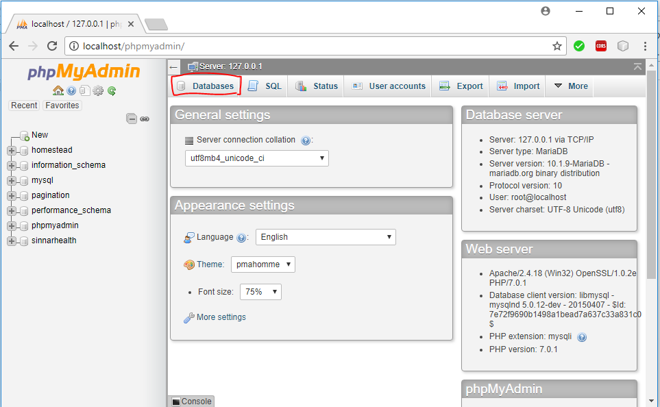{width="554" height="342"}

[[In the Database Name field write the database name and specify the
database collection. In database name write \[tourism\] and in
collection select \[utf8-general-ci\]. And then click on create
button.]{lang="en-US"}]{lang="en-GB"}

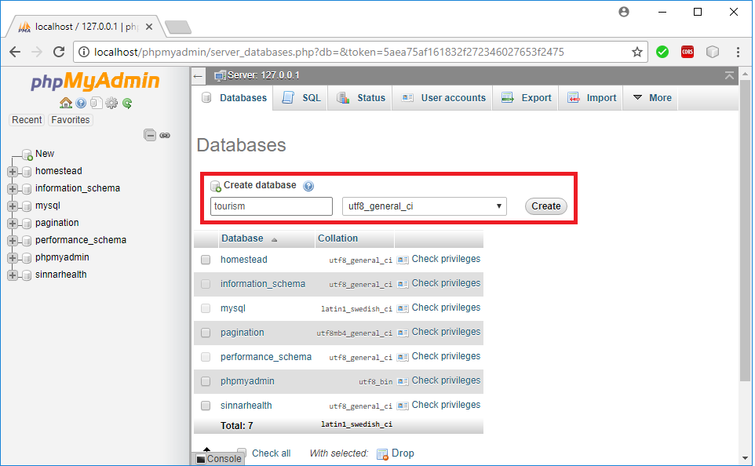{width="553" height="341"}

[[Once the database created the phpMyAdmin asking you to create table.
In the create table form write \[hotels\] for the table name, for Number
of Columns write \[8\]. And then click Go.]{lang="en-US"}]{lang="en-GB"}

{width="553" height="341"}

[[Now we have to specify the properties of eight columns. The columns
are (ID, NAME, DESCRIPTION, PHONE, EMAIL, STARS, LONGITUDE,
LATITUDE).]{lang="en-US"}]{lang="en-GB"}

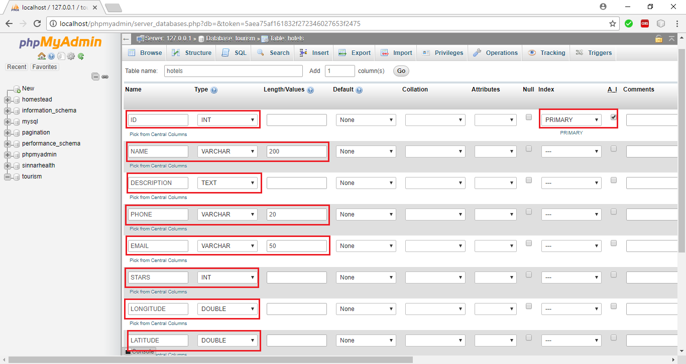{width="553" height="295"}

[[And then click save. The following screen explain the structure of the
hotels table.]{lang="en-US"}]{lang="en-GB"}

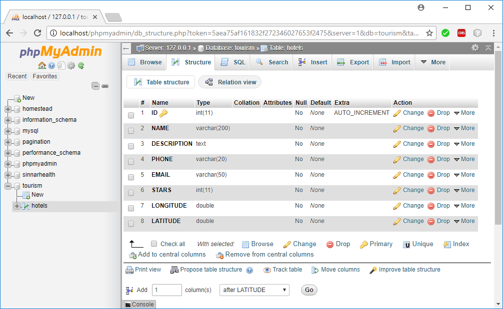{width="554" height="341"}

[[Click on the insert link to insert some data for testing purpose.
insert the following information and click
Go.]{lang="en-US"}]{lang="en-GB"}

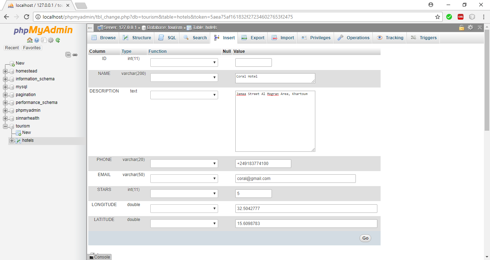{width="554" height="295"}

[[We need to insert information for another hotel. You can insert the
following data. And click on the Go
button.]{lang="en-US"}]{lang="en-GB"}

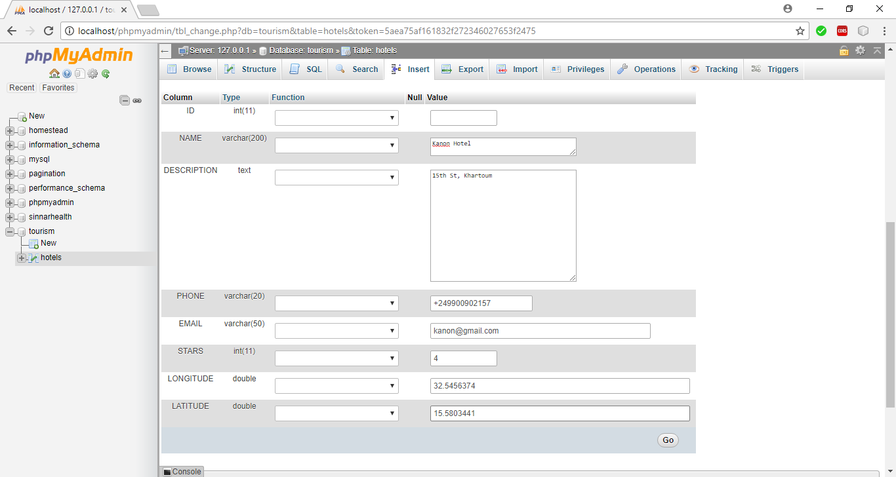{width="554" height="295"}

[[Now we have created our database and table for hotels information and
we have inserted information about two
hotels.]{lang="en-US"}]{lang="en-GB"}

3.  

[[You can use any text editor software to write PHP codes. I am using
Notepad++.]{lang="en-US"}]{lang="en-GB"}

[[Create a new folder in XAMPP root directory (X:\\xampp\\htdocs\\) and
rename the new folder \[hotelsmap\]. And then open Notepad++ editor.
From main menu change select language and change the language to
PHP.]{lang="en-US"}]{lang="en-GB"}

[[The mysqli\_connect(HOST, USERNAME, PASSWORD, DATABASE) command used
to link your PHP application to MySQL Database. in nodepad++ type the
following code.]{lang="en-US"}]{lang="en-GB"}

[[&lt;?php]{style="background: #fdf8e3"}]{lang="en-GB"}

[[\$con]{style="background: #fefcf5"}[
]{style="background: #fefcf5"}[=]{style="background: #fefcf5"}[
]{style="background: #fefcf5"}**[mysqli\_connect]{style="background: #fefcf5"}**[(]{style="background: #fefcf5"}["localhost"]{style="background: #fefcf5"}[,]{style="background: #fefcf5"}["root"]{style="background: #fefcf5"}[,]{style="background: #fefcf5"}["root"]{style="background: #fefcf5"}[,]{style="background: #fefcf5"}["tourism"]{style="background: #fefcf5"}[)]{style="background: #fefcf5"}[
]{style="background: #fefcf5"}]{lang="en-GB"}

[ ]{style="background: #fefcf5"}[**[or]{style="background: #fefcf5"}**[
]{style="background: #fefcf5"}**[die]{style="background: #fefcf5"}**[(]{style="background: #fefcf5"}["
Connection Error !
"]{style="background: #fefcf5"}[);]{style="background: #fefcf5"}]{lang="en-GB"}

[[?&gt;]{style="background: #fdf8e3"}]{lang="en-GB"}

\
\

[[Save your file in the hotelsmap folder and name it getHotels.php.
mysqli\_query(DATABASE\_LINK, SQL\_STATEMENT) is used to execute any SQL
query in MySQL database.]{lang="en-US"}]{lang="en-GB"}

[[&lt;?php]{style="background: #fdf8e3"}]{lang="en-GB"}

[[\$con]{style="background: #fefcf5"}[
]{style="background: #fefcf5"}[=]{style="background: #fefcf5"}[
]{style="background: #fefcf5"}**[mysqli\_connect]{style="background: #fefcf5"}**[(]{style="background: #fefcf5"}["localhost"]{style="background: #fefcf5"}[,]{style="background: #fefcf5"}["root"]{style="background: #fefcf5"}[,]{style="background: #fefcf5"}["root"]{style="background: #fefcf5"}[,]{style="background: #fefcf5"}["tourism"]{style="background: #fefcf5"}[)]{style="background: #fefcf5"}[
]{style="background: #fefcf5"}]{lang="en-GB"}

[ ]{style="background: #fefcf5"}[**[or]{style="background: #fefcf5"}**[
]{style="background: #fefcf5"}**[die]{style="background: #fefcf5"}**[(]{style="background: #fefcf5"}["
Connection Error !
"]{style="background: #fefcf5"}[);]{style="background: #fefcf5"}]{lang="en-GB"}

[ ]{style="background: #fefcf5"}

[[\$query]{style="background: #fefcf5"}[
]{style="background: #fefcf5"}[=]{style="background: #fefcf5"}[
]{style="background: #fefcf5"}**[mysqli\_query]{style="background: #fefcf5"}**[(]{style="background: #fefcf5"}[\$con]{style="background: #fefcf5"}[
]{style="background: #fefcf5"}[,]{style="background: #fefcf5"}[
]{style="background: #fefcf5"}["SELECT \* FROM
hotels;"]{style="background: #fefcf5"}[);]{style="background: #fefcf5"}]{lang="en-GB"}

\

[[?&gt;]{style="background: #fdf8e3"}]{lang="en-GB"}

\
\

[[We create an array to store the SQL query results. The following
command is used to create array in PHP.]{lang="en-US"}]{lang="en-GB"}

[[\$temp]{style="background: #fefcf5"}[
]{style="background: #fefcf5"}[=]{style="background: #fefcf5"}[
]{style="background: #fefcf5"}**[Array]{style="background: #fefcf5"}**[();]{style="background: #fefcf5"}]{lang="en-GB"}

[[Mysqli\_fetch\_assoc(QUERY\_VARIABLE) is used to read query result
data from MySQL database row by row, we will put it in while loop to
read all query result rows. And store this rows in our temp
array.]{lang="en-US"}]{lang="en-GB"}

[[&lt;?php]{style="background: #fdf8e3"}]{lang="en-GB"}

[[\$con]{style="background: #fefcf5"}[
]{style="background: #fefcf5"}[=]{style="background: #fefcf5"}[
]{style="background: #fefcf5"}**[mysqli\_connect]{style="background: #fefcf5"}**[(]{style="background: #fefcf5"}["localhost"]{style="background: #fefcf5"}[,]{style="background: #fefcf5"}["root"]{style="background: #fefcf5"}[,]{style="background: #fefcf5"}["root"]{style="background: #fefcf5"}[,]{style="background: #fefcf5"}["tourism"]{style="background: #fefcf5"}[)]{style="background: #fefcf5"}[
]{style="background: #fefcf5"}]{lang="en-GB"}

[ ]{style="background: #fefcf5"}[**[or]{style="background: #fefcf5"}**[
]{style="background: #fefcf5"}**[die]{style="background: #fefcf5"}**[(]{style="background: #fefcf5"}["
Connection Error !
"]{style="background: #fefcf5"}[);]{style="background: #fefcf5"}]{lang="en-GB"}

[ ]{style="background: #fefcf5"}

[[\$query]{style="background: #fefcf5"}[
]{style="background: #fefcf5"}[=]{style="background: #fefcf5"}[
]{style="background: #fefcf5"}**[mysqli\_query]{style="background: #fefcf5"}**[(]{style="background: #fefcf5"}[\$con]{style="background: #fefcf5"}[
]{style="background: #fefcf5"}[,]{style="background: #fefcf5"}[
]{style="background: #fefcf5"}["SELECT \* FROM
hotels;"]{style="background: #fefcf5"}[);]{style="background: #fefcf5"}]{lang="en-GB"}

[[\$temp]{style="background: #fefcf5"}[
]{style="background: #fefcf5"}[=]{style="background: #fefcf5"}[
]{style="background: #fefcf5"}**[Array]{style="background: #fefcf5"}**[();]{style="background: #fefcf5"}]{lang="en-GB"}

[**[while]{style="background: #fefcf5"}**[(]{style="background: #fefcf5"}[\$row]{style="background: #fefcf5"}[
]{style="background: #fefcf5"}[=]{style="background: #fefcf5"}[
]{style="background: #fefcf5"}**[mysqli\_fetch\_assoc]{style="background: #fefcf5"}**[(]{style="background: #fefcf5"}[\$query]{style="background: #fefcf5"}[)){]{style="background: #fefcf5"}]{lang="en-GB"}

[
]{style="background: #fefcf5"}[[\$temp]{style="background: #fefcf5"}[\[\]]{style="background: #fefcf5"}[
]{style="background: #fefcf5"}[=]{style="background: #fefcf5"}[
]{style="background: #fefcf5"}[\$row]{style="background: #fefcf5"}[
]{style="background: #fefcf5"}[;]{style="background: #fefcf5"}]{lang="en-GB"}

[[}]{style="background: #fefcf5"}]{lang="en-GB"}

[[?&gt;]{style="background: #fdf8e3"}]{lang="en-GB"}

\
\

[[Echo statement used to display text in the web page, and json\_encode
is used to convert the query result array to JSON
format.]{lang="en-US"}]{lang="en-GB"}

[[&lt;?php]{style="background: #fdf8e3"}]{lang="en-GB"}

[[\$con]{style="background: #fefcf5"}[
]{style="background: #fefcf5"}[=]{style="background: #fefcf5"}[
]{style="background: #fefcf5"}**[mysqli\_connect]{style="background: #fefcf5"}**[(]{style="background: #fefcf5"}["localhost"]{style="background: #fefcf5"}[,]{style="background: #fefcf5"}["root"]{style="background: #fefcf5"}[,]{style="background: #fefcf5"}["root"]{style="background: #fefcf5"}[,]{style="background: #fefcf5"}["tourism"]{style="background: #fefcf5"}[)]{style="background: #fefcf5"}[
]{style="background: #fefcf5"}]{lang="en-GB"}

[ ]{style="background: #fefcf5"}[**[or]{style="background: #fefcf5"}**[
]{style="background: #fefcf5"}**[die]{style="background: #fefcf5"}**[(]{style="background: #fefcf5"}["
Connection Error !
"]{style="background: #fefcf5"}[);]{style="background: #fefcf5"}]{lang="en-GB"}

[ ]{style="background: #fefcf5"}

[[\$query]{style="background: #fefcf5"}[
]{style="background: #fefcf5"}[=]{style="background: #fefcf5"}[
]{style="background: #fefcf5"}**[mysqli\_query]{style="background: #fefcf5"}**[(]{style="background: #fefcf5"}[\$con]{style="background: #fefcf5"}[
]{style="background: #fefcf5"}[,]{style="background: #fefcf5"}[
]{style="background: #fefcf5"}["SELECT \* FROM
hotels;"]{style="background: #fefcf5"}[);]{style="background: #fefcf5"}]{lang="en-GB"}

[[\$temp]{style="background: #fefcf5"}[
]{style="background: #fefcf5"}[=]{style="background: #fefcf5"}[
]{style="background: #fefcf5"}**[Array]{style="background: #fefcf5"}**[();]{style="background: #fefcf5"}]{lang="en-GB"}

[**[while]{style="background: #fefcf5"}**[(]{style="background: #fefcf5"}[\$row]{style="background: #fefcf5"}[
]{style="background: #fefcf5"}[=]{style="background: #fefcf5"}[
]{style="background: #fefcf5"}**[mysqli\_fetch\_assoc]{style="background: #fefcf5"}**[(]{style="background: #fefcf5"}[\$query]{style="background: #fefcf5"}[)){]{style="background: #fefcf5"}]{lang="en-GB"}

[
]{style="background: #fefcf5"}[[\$temp]{style="background: #fefcf5"}[\[\]]{style="background: #fefcf5"}[
]{style="background: #fefcf5"}[=]{style="background: #fefcf5"}[
]{style="background: #fefcf5"}[\$row]{style="background: #fefcf5"}[
]{style="background: #fefcf5"}[;]{style="background: #fefcf5"}]{lang="en-GB"}

[[}]{style="background: #fefcf5"}]{lang="en-GB"}

[**[echo]{style="background: #fefcf5"}**[
]{style="background: #fefcf5"}**[json\_encode]{style="background: #fefcf5"}**[(]{style="background: #fefcf5"}[\$temp]{style="background: #fefcf5"}[);]{style="background: #fefcf5"}]{lang="en-GB"}

[[?&gt;]{style="background: #fdf8e3"}]{lang="en-GB"}

\
\

[[Now save your edits and open your web browser and in address bar type
the following URL:
<http://localhost/hotelsmap/getHotels.php>.]{lang="en-US"}]{lang="en-GB"}

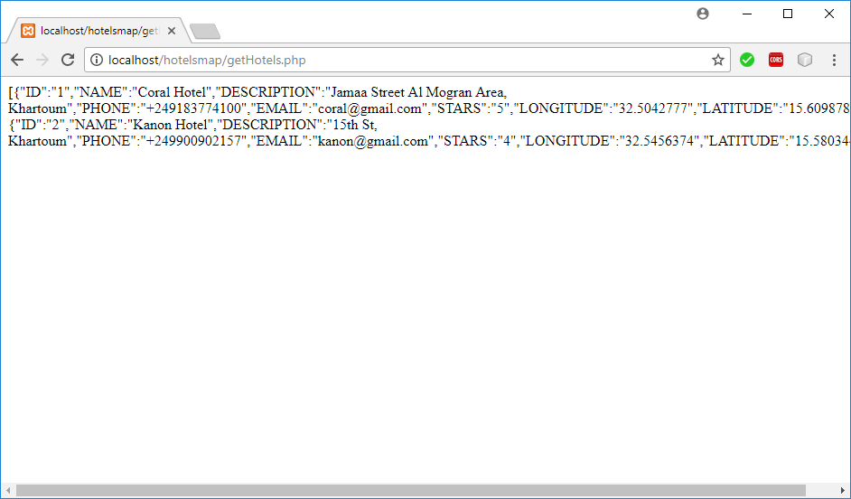{width="554" height="324"}

[[The above screenshot shows the output of our PHP application which
display data from MySQL database in JSON
format.]{lang="en-US"}]{lang="en-GB"}

4.  

[[Google Map API is a set of methods that allow you to display google
map on your web site. You have to create Google Map API Key to use
google map in your application.]{lang="en-US"}]{lang="en-GB"}

[[In Notepad++ from file menu create a new file and change the language
to HTML. And type the basic code of HTML
page.]{lang="en-US"}]{lang="en-GB"}

[&lt;html&gt;]{lang="en-GB"}

[&lt;head&gt;]{lang="en-GB"}

[&lt;title&gt; **Hotels Information System**
&lt;/title&gt;]{lang="en-GB"}

[&lt;/head&gt;]{lang="en-GB"}

[&lt;body&gt;]{lang="en-GB"}

[&lt;div id=**"mapDiv"** style=**"width:600px;
height:600px;"**&gt;&lt;/div&gt;]{lang="en-GB"}

[&lt;/body&gt;]{lang="en-GB"}

[&lt;/html&gt;]{lang="en-GB"}

\
\

[[Google map API is JavaScript library and you can use script tag to
load it on your page.]{lang="en-US"}]{lang="en-GB"}

[]{#OLE_LINK2}[]{#OLE_LINK1} [&lt;script
src=**"https://maps.googleapis.com/maps/api/js?key=AIzaSyDacd2StMFpb4xOdQk2Gg5Gk-CjJoc"**&gt;&lt;/script&gt;]{lang="en-GB"}

[Open a script tag to write your javascript code to load google map on
your page. The first step you have to specify the properties of the map.
Which include center and zoom level and map type, and then use the
google.maps.Map (MAPCONTAINER, MAPPROPERTIES) function to create the
map. The google.maps.event.addDomListener(OBJECT, ‘EVENT’,
HANDELERMETHOD) function used to implement events. ]{lang="en-GB"}

[&lt;html&gt;]{lang="en-GB"}

[&lt;head&gt;]{lang="en-GB"}

[&lt;title&gt; **Hotels Information System**
&lt;/title&gt;]{lang="en-GB"}

[&lt;script
src=**"https://maps.googleapis.com/maps/api/js?key=AIzaSyDacd2StMFpb4xOdQk2Gg5Gk-CjJoc"**&gt;&lt;/script&gt;]{lang="en-GB"}

\

[&lt;script&gt;]{lang="en-GB"}

[***[function]{style="background: #f2f4ff"}***[
loadMap]{style="background: #f2f4ff"}**[(){]{style="background: #f2f4ff"}**]{lang="en-GB"}

[
]{style="background: #f2f4ff"}[***[var]{style="background: #f2f4ff"}***[
mapOption
]{style="background: #f2f4ff"}**[=]{style="background: #f2f4ff"}**[
]{style="background: #f2f4ff"}**[{]{style="background: #f2f4ff"}**]{lang="en-GB"}

[
[center]{lang="en-GB"}**[:]{style="background: #f2f4ff"}*****[new]{style="background: #f2f4ff"}***[
google.maps.LatLng]{style="background: #f2f4ff"}**[(]{style="background: #f2f4ff"}**[15.6]{style="background: #f2f4ff"}**[,]{style="background: #f2f4ff"}**[
]{style="background: #f2f4ff"}[32.5]{style="background: #f2f4ff"}**[),]{style="background: #f2f4ff"}**[
]{style="background: #f2f4ff"}]{style="background: #f2f4ff"}

[
[zoom]{lang="en-GB"}**[:]{style="background: #f2f4ff"}**[12]{style="background: #f2f4ff"}**[,]{style="background: #f2f4ff"}**]{style="background: #f2f4ff"}

[
[mapTypeId]{lang="en-GB"}**[:]{style="background: #f2f4ff"}**[google.maps.MapTypeId.ROAD]{style="background: #f2f4ff"}]{style="background: #f2f4ff"}

[
]{style="background: #f2f4ff"}[**[};]{style="background: #f2f4ff"}**]{lang="en-GB"}

[ [map ]{lang="en-GB"}**[=]{style="background: #f2f4ff"}**[
]{style="background: #f2f4ff"}***[new]{style="background: #f2f4ff"}***[
google.maps.Map]{style="background: #f2f4ff"}**[(]{style="background: #f2f4ff"}**[document.getElementById]{style="background: #f2f4ff"}**[(]{style="background: #f2f4ff"}**['mapDiv']{style="background: #f2f4ff"}**[),]{style="background: #f2f4ff"}**[
mapOption]{style="background: #f2f4ff"}**[);]{style="background: #f2f4ff"}**]{style="background: #f2f4ff"}

[**[}]{style="background: #f2f4ff"}**]{lang="en-GB"}

[[google.maps.event.addDomListener]{style="background: #f2f4ff"}**[(]{style="background: #f2f4ff"}**[window]{style="background: #f2f4ff"}**[,]{style="background: #f2f4ff"}**[
]{style="background: #f2f4ff"}['load']{style="background: #f2f4ff"}**[,]{style="background: #f2f4ff"}**[
loadMap]{style="background: #f2f4ff"}**[);]{style="background: #f2f4ff"}**]{lang="en-GB"}

[&lt;/script&gt;]{lang="en-GB"}

\

[&lt;/head&gt;]{lang="en-GB"}

[&lt;body&gt;]{lang="en-GB"}

[&lt;div id=**"mapDiv"** style=**"width:600px;
height:600px;"**&gt;&lt;/div&gt;]{lang="en-GB"}

[&lt;/body&gt;]{lang="en-GB"}

[&lt;/html&gt;]{lang="en-GB"}

\
\

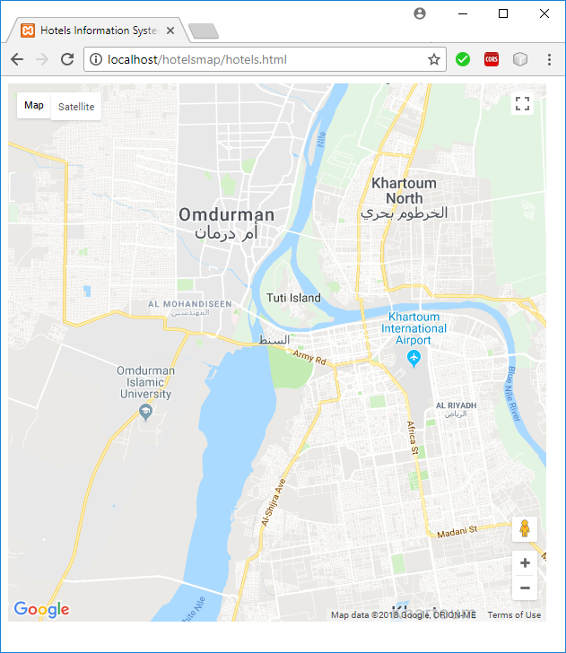{width="554" height="639"}

[[To load hotels data from PHP application which display the hotels
information in JSON format, we will use jQuery library. jQuery is a fast
and concise JavaScript Library created by John Resig in 2006 with a nice
motto: ]{style="background: #ffffff"}**[Write less, do
more]{style="background: #ffffff"}**[. jQuery simplifies HTML document
traversing, event handling, animating, and Ajax interactions for rapid
web development. You]{style="background: #ffffff"}[[ can include jQuery
to your web pages using the script
tag.]{style="background: #ffffff"}]{lang="en-US"}]{lang="en-GB"}

[&lt;script
src=**"https://ajax.googleapis.com/ajax/libs/jquery/3.3.1/jquery.min.js"**&gt;&lt;/script&gt;]{lang="en-GB"}

\
\

[[The \$.post(“serverpage”, {DATA}, function(result)); jQuery method is
used to send and get information from server side applications.
JSON.parse(data) is used to convert the results of PHP application from
JSON format to JavaScript objects array.
]{style="background: #ffffff"}]{lang="en-GB"}

[[The google.maps.LatLng(LATITUDE, LONGITUDE) is used specify the
coordinates of hotel position. And the google.maps.Marker(MAP, POSITION,
TITLE, ICON, DRAGGABLE, ANIMATION) is used to create marker on top of
google map.]{style="background: #ffffff"}]{lang="en-GB"}

[[We will create a new function above the loadMap() function to create
the marker. And we will create a
variable.]{style="background: #ffffff"}]{lang="en-GB"}

[&lt;script&gt;]{lang="en-GB"}

[***[function]{style="background: #f2f4ff"}***[
createMarker]{style="background: #f2f4ff"}**[(]{style="background: #f2f4ff"}**[latlng]{style="background: #f2f4ff"}**[,]{style="background: #f2f4ff"}**[
hdata]{style="background: #f2f4ff"}**[){]{style="background: #f2f4ff"}**]{lang="en-GB"}

[
]{style="background: #f2f4ff"}[***[var]{style="background: #f2f4ff"}***[
mark ]{style="background: #f2f4ff"}**[=]{style="background: #f2f4ff"}**[
]{style="background: #f2f4ff"}***[new]{style="background: #f2f4ff"}***[
google.maps.Marker]{style="background: #f2f4ff"}**[({]{style="background: #f2f4ff"}**]{lang="en-GB"}

[[map]{style="background: #f2f4ff"}**[:]{style="background: #f2f4ff"}**[map]{style="background: #f2f4ff"}**[,]{style="background: #f2f4ff"}**[
position]{style="background: #f2f4ff"}**[:]{style="background: #f2f4ff"}**[latlng]{style="background: #f2f4ff"}**[,]{style="background: #f2f4ff"}**[
title]{style="background: #f2f4ff"}**[:]{style="background: #f2f4ff"}**[hdata.NAME]{style="background: #f2f4ff"}**[});]{style="background: #f2f4ff"}**]{lang="en-GB"}

[**[}]{style="background: #f2f4ff"}**]{lang="en-GB"}

[***[function]{style="background: #f2f4ff"}***[
loadMap]{style="background: #f2f4ff"}**[(){]{style="background: #f2f4ff"}**]{lang="en-GB"}

[
]{style="background: #f2f4ff"}[***[var]{style="background: #f2f4ff"}***[
mapOption
]{style="background: #f2f4ff"}**[=]{style="background: #f2f4ff"}**[
]{style="background: #f2f4ff"}**[{]{style="background: #f2f4ff"}**]{lang="en-GB"}

[
[center]{lang="en-GB"}**[:]{style="background: #f2f4ff"}*****[new]{style="background: #f2f4ff"}***[
google.maps.LatLng]{style="background: #f2f4ff"}**[(]{style="background: #f2f4ff"}**[15.6]{style="background: #f2f4ff"}**[,]{style="background: #f2f4ff"}**[
]{style="background: #f2f4ff"}[32.5]{style="background: #f2f4ff"}**[),]{style="background: #f2f4ff"}**[
]{style="background: #f2f4ff"}]{style="background: #f2f4ff"}

[
[zoom]{lang="en-GB"}**[:]{style="background: #f2f4ff"}**[12]{style="background: #f2f4ff"}**[,]{style="background: #f2f4ff"}**]{style="background: #f2f4ff"}

[
[mapTypeId]{lang="en-GB"}**[:]{style="background: #f2f4ff"}**[google.maps.MapTypeId.ROAD]{style="background: #f2f4ff"}]{style="background: #f2f4ff"}

[
]{style="background: #f2f4ff"}[**[};]{style="background: #f2f4ff"}**]{lang="en-GB"}

[ [map ]{lang="en-GB"}**[=]{style="background: #f2f4ff"}**[
]{style="background: #f2f4ff"}***[new]{style="background: #f2f4ff"}***[
google.maps.Map]{style="background: #f2f4ff"}**[(]{style="background: #f2f4ff"}**]{style="background: #f2f4ff"}

[[document.getElementById]{style="background: #f2f4ff"}**[(]{style="background: #f2f4ff"}**['mapDiv']{style="background: #f2f4ff"}**[),]{style="background: #f2f4ff"}**[
mapOption]{style="background: #f2f4ff"}**[);]{style="background: #f2f4ff"}**]{lang="en-GB"}

[
]{style="background: #f2f4ff"}[***[var]{style="background: #f2f4ff"}***[
hotelsData
]{style="background: #f2f4ff"}**[;]{style="background: #f2f4ff"}**]{lang="en-GB"}

[
[\$]{lang="en-GB"}**[.]{style="background: #f2f4ff"}**[post]{style="background: #f2f4ff"}**[(]{style="background: #f2f4ff"}**['getHotels.php']{style="background: #f2f4ff"}**[,]{style="background: #f2f4ff"}**[
]{style="background: #f2f4ff"}***[function]{style="background: #f2f4ff"}*****[(]{style="background: #f2f4ff"}**[data]{style="background: #f2f4ff"}**[){]{style="background: #f2f4ff"}**]{style="background: #f2f4ff"}

[ [hotelsData ]{lang="en-GB"}**[=]{style="background: #f2f4ff"}**[
JSON.parse]{style="background: #f2f4ff"}**[(]{style="background: #f2f4ff"}**[data]{style="background: #f2f4ff"}**[);]{style="background: #f2f4ff"}**]{style="background: #f2f4ff"}

[
]{style="background: #f2f4ff"}[***[for]{style="background: #f2f4ff"}*****[(]{style="background: #f2f4ff"}**[i
]{style="background: #f2f4ff"}**[=]{style="background: #f2f4ff"}**[
]{style="background: #f2f4ff"}[0]{style="background: #f2f4ff"}[
]{style="background: #f2f4ff"}**[;]{style="background: #f2f4ff"}**[ i
]{style="background: #f2f4ff"}**[&lt;]{style="background: #f2f4ff"}**[
hotelsData.length]{style="background: #f2f4ff"}**[;]{style="background: #f2f4ff"}**[
i]{style="background: #f2f4ff"}**[++){]{style="background: #f2f4ff"}**]{lang="en-GB"}

[
]{style="background: #f2f4ff"}[***[var]{style="background: #f2f4ff"}***[
latlng
]{style="background: #f2f4ff"}**[=]{style="background: #f2f4ff"}**[
]{style="background: #f2f4ff"}***[new]{style="background: #f2f4ff"}***[
google.maps.LatLng]{style="background: #f2f4ff"}**[(]{style="background: #f2f4ff"}**]{lang="en-GB"}

[[hotelsData]{style="background: #f2f4ff"}**[\[]{style="background: #f2f4ff"}**[i]{style="background: #f2f4ff"}**[\].]{style="background: #f2f4ff"}**[LATITUDE]{style="background: #f2f4ff"}**[,]{style="background: #f2f4ff"}**[
hotelsData]{style="background: #f2f4ff"}**[\[]{style="background: #f2f4ff"}**[i]{style="background: #f2f4ff"}**[\].]{style="background: #f2f4ff"}**[LONGITUDE]{style="background: #f2f4ff"}**[);]{style="background: #f2f4ff"}**]{lang="en-GB"}

[
]{style="background: #f2f4ff"}[***[var]{style="background: #f2f4ff"}***[
hdata
]{style="background: #f2f4ff"}**[=]{style="background: #f2f4ff"}**[
hotelsData]{style="background: #f2f4ff"}**[\[]{style="background: #f2f4ff"}**[i]{style="background: #f2f4ff"}**[\];]{style="background: #f2f4ff"}**]{lang="en-GB"}

[
[createMarker]{lang="en-GB"}**[(]{style="background: #f2f4ff"}**[latlng]{style="background: #f2f4ff"}**[,]{style="background: #f2f4ff"}**[
hdata]{style="background: #f2f4ff"}**[);]{style="background: #f2f4ff"}**]{style="background: #f2f4ff"}

[
]{style="background: #f2f4ff"}[**[}]{style="background: #f2f4ff"}**]{lang="en-GB"}

[
]{style="background: #f2f4ff"}[**[});]{style="background: #f2f4ff"}**]{lang="en-GB"}

[**[}]{style="background: #f2f4ff"}**]{lang="en-GB"}

[[google.maps.event.addDomListener]{style="background: #f2f4ff"}**[(]{style="background: #f2f4ff"}**[window]{style="background: #f2f4ff"}**[,]{style="background: #f2f4ff"}**[
]{style="background: #f2f4ff"}['load']{style="background: #f2f4ff"}**[,]{style="background: #f2f4ff"}**[
loadMap]{style="background: #f2f4ff"}**[);]{style="background: #f2f4ff"}**]{lang="en-GB"}

[&lt;/script&gt;]{lang="en-GB"}

\
\

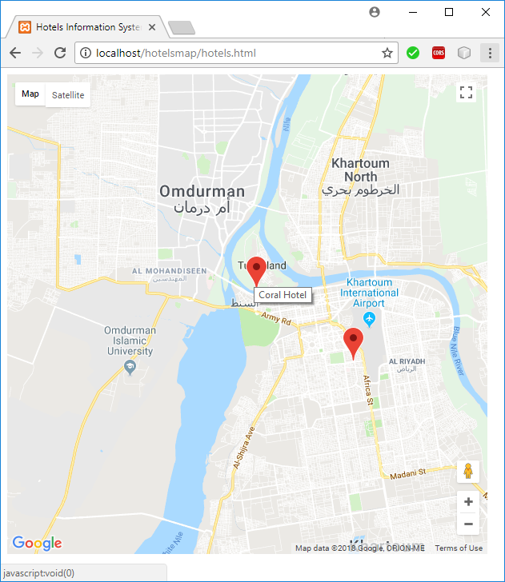{width="554" height="639"}

\
\

5.  

[[Inside the createMarker() function and after google.maps.Marker()
create a new instance o from google.maps.InfoWindow(). And then use the
setContenet() method to set the content of InfoWindow and the use the
google.maps.event.AddDomListener(OBJECT, ‘EVENT’, HANDLER) to open the
infoWindow when user click on the marker. We will show the information
in HTML form.]{style="background: #ffffff"}]{lang="en-GB"}

\
\

[&lt;html&gt;]{lang="en-GB"}

[&lt;head&gt;]{lang="en-GB"}

[&lt;title&gt; **Hotels Information System**
&lt;/title&gt;]{lang="en-GB"}

[&lt;script
src=**"https://maps.googleapis.com/maps/api/js?key=AIzaSyDacd2StMFpb4xOdQk2Gg5Gk-CjJoc"**&gt;&lt;/script&gt;]{lang="en-GB"}

[&lt;script
src=**"https://ajax.googleapis.com/ajax/libs/jquery/3.3.1/jquery.min.js"**&gt;&lt;/script&gt;]{lang="en-GB"}

[&lt;script&gt;]{lang="en-GB"}

[***[function]{style="background: #f2f4ff"}***[
createMarker]{style="background: #f2f4ff"}**[(]{style="background: #f2f4ff"}**[latlng]{style="background: #f2f4ff"}**[,]{style="background: #f2f4ff"}**[
hdata]{style="background: #f2f4ff"}**[){]{style="background: #f2f4ff"}**]{lang="en-GB"}

[
]{style="background: #f2f4ff"}[***[var]{style="background: #f2f4ff"}***[
mark ]{style="background: #f2f4ff"}**[=]{style="background: #f2f4ff"}**[
]{style="background: #f2f4ff"}***[new]{style="background: #f2f4ff"}***[
google.maps.Marker]{style="background: #f2f4ff"}**[({]{style="background: #f2f4ff"}**[map]{style="background: #f2f4ff"}**[:]{style="background: #f2f4ff"}**[map]{style="background: #f2f4ff"}**[,]{style="background: #f2f4ff"}**[
position]{style="background: #f2f4ff"}**[:]{style="background: #f2f4ff"}**[latlng]{style="background: #f2f4ff"}**[,]{style="background: #f2f4ff"}**[
title]{style="background: #f2f4ff"}**[:]{style="background: #f2f4ff"}**[hdata.NAME]{style="background: #f2f4ff"}**[});]{style="background: #f2f4ff"}**]{lang="en-GB"}

[
[google.maps.event.addDomListener]{lang="en-GB"}**[(]{style="background: #f2f4ff"}**[mark]{style="background: #f2f4ff"}**[,]{style="background: #f2f4ff"}**[
]{style="background: #f2f4ff"}['click']{style="background: #f2f4ff"}**[,]{style="background: #f2f4ff"}**[
]{style="background: #f2f4ff"}***[function]{style="background: #f2f4ff"}*****[(]{style="background: #f2f4ff"}**[evt]{style="background: #f2f4ff"}**[){]{style="background: #f2f4ff"}**]{style="background: #f2f4ff"}

[ [info ]{lang="en-GB"}**[=]{style="background: #f2f4ff"}**[
]{style="background: #f2f4ff"}***[new]{style="background: #f2f4ff"}***[
google.maps.InfoWindow]{style="background: #f2f4ff"}**[();]{style="background: #f2f4ff"}**]{style="background: #f2f4ff"}

[
]{style="background: #f2f4ff"}[***[var]{style="background: #f2f4ff"}***[
info ]{style="background: #f2f4ff"}**[=]{style="background: #f2f4ff"}**[
]{style="background: #f2f4ff"}['&lt;form
id="frmData"&gt;']{style="background: #f2f4ff"}[
]{style="background: #f2f4ff"}**[+]{style="background: #f2f4ff"}**]{lang="en-GB"}

[ ]{style="background: #f2f4ff"}[['&lt;input type="hidden" name="ID"
value="']{style="background: #f2f4ff"}**[+]{style="background: #f2f4ff"}**[
hdata.ID
]{style="background: #f2f4ff"}**[+]{style="background: #f2f4ff"}**['"&gt;']{style="background: #f2f4ff"}[
]{style="background: #f2f4ff"}**[+]{style="background: #f2f4ff"}**[
]{style="background: #f2f4ff"}]{lang="en-GB"}

[ ]{style="background: #f2f4ff"}[['&lt;input type="text" name="NAME"
value="']{style="background: #f2f4ff"}**[+]{style="background: #f2f4ff"}**[
hdata.NAME
]{style="background: #f2f4ff"}**[+]{style="background: #f2f4ff"}**['"&gt;&lt;br/&gt;']{style="background: #f2f4ff"}[
]{style="background: #f2f4ff"}**[+]{style="background: #f2f4ff"}**]{lang="en-GB"}

[ ]{style="background: #f2f4ff"}[['&lt;input type="text" name="EMAIL"
value="']{style="background: #f2f4ff"}**[+]{style="background: #f2f4ff"}**[
hdata.EMAIL
]{style="background: #f2f4ff"}**[+]{style="background: #f2f4ff"}**['"&gt;&lt;br/&gt;']{style="background: #f2f4ff"}[
]{style="background: #f2f4ff"}**[+]{style="background: #f2f4ff"}**]{lang="en-GB"}

[ ]{style="background: #f2f4ff"}[['&lt;input type="text" name="PHONE"
value="']{style="background: #f2f4ff"}**[+]{style="background: #f2f4ff"}**[
hdata.PHONE
]{style="background: #f2f4ff"}**[+]{style="background: #f2f4ff"}**['"&gt;&lt;br/&gt;']{style="background: #f2f4ff"}[
]{style="background: #f2f4ff"}**[+]{style="background: #f2f4ff"}**]{lang="en-GB"}

[ ]{style="background: #f2f4ff"}[['&lt;input type="text" name="STARS"
value="']{style="background: #f2f4ff"}**[+]{style="background: #f2f4ff"}**[
hdata.STARS
]{style="background: #f2f4ff"}**[+]{style="background: #f2f4ff"}**['"&gt;&lt;br/&gt;']{style="background: #f2f4ff"}[
]{style="background: #f2f4ff"}**[+]{style="background: #f2f4ff"}**]{lang="en-GB"}

[ ]{style="background: #f2f4ff"}[['&lt;input type="text"
name="LONGITUDE"
value="']{style="background: #f2f4ff"}**[+]{style="background: #f2f4ff"}**[
hdata.LONGITUDE
]{style="background: #f2f4ff"}**[+]{style="background: #f2f4ff"}**['"&gt;&lt;br/&gt;']{style="background: #f2f4ff"}[
]{style="background: #f2f4ff"}**[+]{style="background: #f2f4ff"}**]{lang="en-GB"}

[ ]{style="background: #f2f4ff"}[['&lt;input type="text" name="LATITUDE"
value="']{style="background: #f2f4ff"}**[+]{style="background: #f2f4ff"}**[
hdata.LATITUDE
]{style="background: #f2f4ff"}**[+]{style="background: #f2f4ff"}**['"&gt;&lt;br/&gt;']{style="background: #f2f4ff"}[
]{style="background: #f2f4ff"}**[+]{style="background: #f2f4ff"}**]{lang="en-GB"}

[ ]{style="background: #f2f4ff"}[['&lt;input type="text"
name="DESCRIPTION"
value="']{style="background: #f2f4ff"}**[+]{style="background: #f2f4ff"}**[
hdata.DESCRIPTION
]{style="background: #f2f4ff"}**[+]{style="background: #f2f4ff"}**['"&gt;&lt;br/&gt;']{style="background: #f2f4ff"}[
]{style="background: #f2f4ff"}**[+]{style="background: #f2f4ff"}**]{lang="en-GB"}

[ ]{style="background: #f2f4ff"}[['&lt;input type="button"
value="UPDATE"&gt;']{style="background: #f2f4ff"}[
]{style="background: #f2f4ff"}**[+]{style="background: #f2f4ff"}**[
]{style="background: #f2f4ff"}]{lang="en-GB"}

[ ]{style="background: #f2f4ff"}[['&lt;input type="button"
value="DELETE"&gt;']{style="background: #f2f4ff"}[
]{style="background: #f2f4ff"}**[+]{style="background: #f2f4ff"}**[
]{style="background: #f2f4ff"}]{lang="en-GB"}

[
]{style="background: #f2f4ff"}[['&lt;/form&gt;']{style="background: #f2f4ff"}**[;]{style="background: #f2f4ff"}**]{lang="en-GB"}

[
[info.setContent]{lang="en-GB"}**[(]{style="background: #f2f4ff"}**['']{style="background: #f2f4ff"}[
]{style="background: #f2f4ff"}**[+]{style="background: #f2f4ff"}**[
i]{style="background: #f2f4ff"}**[);]{style="background: #f2f4ff"}**]{style="background: #f2f4ff"}

[ [info.open]{lang="en-GB"}**[(]{style="background: #f2f4ff"}**[map
]{style="background: #f2f4ff"}**[,]{style="background: #f2f4ff"}**[
mark]{style="background: #f2f4ff"}**[);]{style="background: #f2f4ff"}**]{style="background: #f2f4ff"}

[
]{style="background: #f2f4ff"}[**[});]{style="background: #f2f4ff"}**]{lang="en-GB"}

[**[}]{style="background: #f2f4ff"}**]{lang="en-GB"}

[***[function]{style="background: #f2f4ff"}***[
loadMap]{style="background: #f2f4ff"}**[(){]{style="background: #f2f4ff"}**]{lang="en-GB"}

[
]{style="background: #f2f4ff"}[***[var]{style="background: #f2f4ff"}***[
mapOption
]{style="background: #f2f4ff"}**[=]{style="background: #f2f4ff"}**[
]{style="background: #f2f4ff"}**[{]{style="background: #f2f4ff"}**]{lang="en-GB"}

[
[center]{lang="en-GB"}**[:]{style="background: #f2f4ff"}*****[new]{style="background: #f2f4ff"}***[
google.maps.LatLng]{style="background: #f2f4ff"}**[(]{style="background: #f2f4ff"}**[15.6]{style="background: #f2f4ff"}**[,]{style="background: #f2f4ff"}**[
]{style="background: #f2f4ff"}[32.5]{style="background: #f2f4ff"}**[),]{style="background: #f2f4ff"}**[
]{style="background: #f2f4ff"}]{style="background: #f2f4ff"}

[
[zoom]{lang="en-GB"}**[:]{style="background: #f2f4ff"}**[12]{style="background: #f2f4ff"}**[,]{style="background: #f2f4ff"}**]{style="background: #f2f4ff"}

[
[mapTypeId]{lang="en-GB"}**[:]{style="background: #f2f4ff"}**[google.maps.MapTypeId.ROAD]{style="background: #f2f4ff"}]{style="background: #f2f4ff"}

[
]{style="background: #f2f4ff"}[**[};]{style="background: #f2f4ff"}**]{lang="en-GB"}

[ [map ]{lang="en-GB"}**[=]{style="background: #f2f4ff"}**[
]{style="background: #f2f4ff"}***[new]{style="background: #f2f4ff"}***[
google.maps.Map]{style="background: #f2f4ff"}**[(]{style="background: #f2f4ff"}**[document.getElementById]{style="background: #f2f4ff"}**[(]{style="background: #f2f4ff"}**['mapDiv']{style="background: #f2f4ff"}**[),]{style="background: #f2f4ff"}**[
mapOption]{style="background: #f2f4ff"}**[);]{style="background: #f2f4ff"}**]{style="background: #f2f4ff"}

[
]{style="background: #f2f4ff"}[***[var]{style="background: #f2f4ff"}***[
hotelsData
]{style="background: #f2f4ff"}**[;]{style="background: #f2f4ff"}**]{lang="en-GB"}

[
[\$]{lang="en-GB"}**[.]{style="background: #f2f4ff"}**[post]{style="background: #f2f4ff"}**[(]{style="background: #f2f4ff"}**['getHotels.php']{style="background: #f2f4ff"}**[,]{style="background: #f2f4ff"}**[
]{style="background: #f2f4ff"}***[function]{style="background: #f2f4ff"}*****[(]{style="background: #f2f4ff"}**[data]{style="background: #f2f4ff"}**[){]{style="background: #f2f4ff"}**]{style="background: #f2f4ff"}

[ [hotelsData ]{lang="en-GB"}**[=]{style="background: #f2f4ff"}**[
JSON.parse]{style="background: #f2f4ff"}**[(]{style="background: #f2f4ff"}**[data]{style="background: #f2f4ff"}**[);]{style="background: #f2f4ff"}**]{style="background: #f2f4ff"}

[
]{style="background: #f2f4ff"}[***[for]{style="background: #f2f4ff"}*****[(]{style="background: #f2f4ff"}**[i
]{style="background: #f2f4ff"}**[=]{style="background: #f2f4ff"}**[
]{style="background: #f2f4ff"}[0]{style="background: #f2f4ff"}[
]{style="background: #f2f4ff"}**[;]{style="background: #f2f4ff"}**[ i
]{style="background: #f2f4ff"}**[&lt;]{style="background: #f2f4ff"}**[
hotelsData.length]{style="background: #f2f4ff"}**[;]{style="background: #f2f4ff"}**[
i]{style="background: #f2f4ff"}**[++){]{style="background: #f2f4ff"}**]{lang="en-GB"}

[
]{style="background: #f2f4ff"}[***[var]{style="background: #f2f4ff"}***[
latlng
]{style="background: #f2f4ff"}**[=]{style="background: #f2f4ff"}**[
]{style="background: #f2f4ff"}***[new]{style="background: #f2f4ff"}***[
google.maps.LatLng]{style="background: #f2f4ff"}**[(]{style="background: #f2f4ff"}**[hotelsData]{style="background: #f2f4ff"}**[\[]{style="background: #f2f4ff"}**[i]{style="background: #f2f4ff"}**[\].]{style="background: #f2f4ff"}**[LATITUDE]{style="background: #f2f4ff"}**[,]{style="background: #f2f4ff"}**[
hotelsData]{style="background: #f2f4ff"}**[\[]{style="background: #f2f4ff"}**[i]{style="background: #f2f4ff"}**[\].]{style="background: #f2f4ff"}**[LONGITUDE]{style="background: #f2f4ff"}**[);]{style="background: #f2f4ff"}**]{lang="en-GB"}

[
]{style="background: #f2f4ff"}[***[var]{style="background: #f2f4ff"}***[
hdata
]{style="background: #f2f4ff"}**[=]{style="background: #f2f4ff"}**[
hotelsData]{style="background: #f2f4ff"}**[\[]{style="background: #f2f4ff"}**[i]{style="background: #f2f4ff"}**[\];]{style="background: #f2f4ff"}**]{lang="en-GB"}

[
[createMarker]{lang="en-GB"}**[(]{style="background: #f2f4ff"}**[latlng]{style="background: #f2f4ff"}**[,]{style="background: #f2f4ff"}**[
hdata]{style="background: #f2f4ff"}**[);]{style="background: #f2f4ff"}**]{style="background: #f2f4ff"}

[
]{style="background: #f2f4ff"}[**[}]{style="background: #f2f4ff"}**]{lang="en-GB"}

[
]{style="background: #f2f4ff"}[**[});]{style="background: #f2f4ff"}**]{lang="en-GB"}

[**[}]{style="background: #f2f4ff"}**]{lang="en-GB"}

[[google.maps.event.addDomListener]{style="background: #f2f4ff"}**[(]{style="background: #f2f4ff"}**[window]{style="background: #f2f4ff"}**[,]{style="background: #f2f4ff"}**[
]{style="background: #f2f4ff"}['load']{style="background: #f2f4ff"}**[,]{style="background: #f2f4ff"}**[
loadMap]{style="background: #f2f4ff"}**[);]{style="background: #f2f4ff"}**]{lang="en-GB"}

[&lt;/script&gt;]{lang="en-GB"}

[&lt;/head&gt;]{lang="en-GB"}

[&lt;body&gt;]{lang="en-GB"}

[&lt;div id=**"mapDiv"** style=**"width:600px;
height:600px;"**&gt;&lt;/div&gt;]{lang="en-GB"}

[&lt;/body&gt;]{lang="en-GB"}

[&lt;/html&gt;]{lang="en-GB"}

\
\

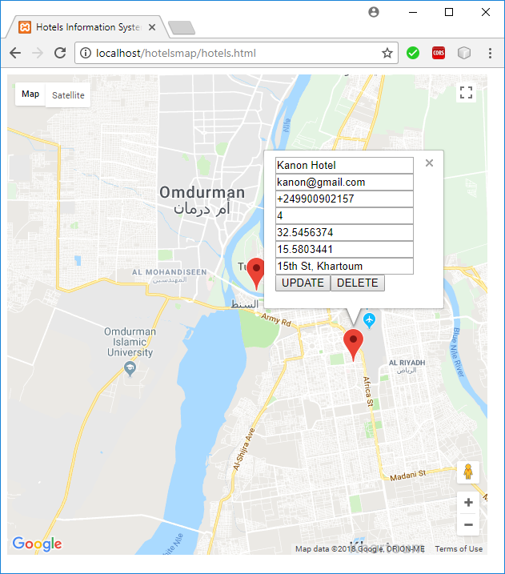{width="554" height="629"}

\
\

[[We will use the update and delete buttons later.
]{style="background: #ffffff"}]{lang="en-GB"}

6.  

[[we will create a new function to add a new hotels. The can add a new
hotel by click on hotel location in google map and then fill the hotel
information. Under loadMap() function create the following
function.]{style="background: #ffffff"}]{lang="en-GB"}

[***[function]{style="background: #f2f4ff"}***[
newHotel]{style="background: #f2f4ff"}**[(){]{style="background: #f2f4ff"}**]{lang="en-GB"}

[
[google.maps.event.addDomListener]{lang="en-GB"}**[(]{style="background: #f2f4ff"}**[map]{style="background: #f2f4ff"}**[,]{style="background: #f2f4ff"}**[
]{style="background: #f2f4ff"}['click']{style="background: #f2f4ff"}**[,]{style="background: #f2f4ff"}**[
]{style="background: #f2f4ff"}***[function]{style="background: #f2f4ff"}*****[(]{style="background: #f2f4ff"}**[evt]{style="background: #f2f4ff"}**[){]{style="background: #f2f4ff"}**]{style="background: #f2f4ff"}

[
]{style="background: #f2f4ff"}[***[var]{style="background: #f2f4ff"}***[
pos ]{style="background: #f2f4ff"}**[=]{style="background: #f2f4ff"}**[
]{style="background: #f2f4ff"}***[new]{style="background: #f2f4ff"}***[
google.maps.LatLng]{style="background: #f2f4ff"}**[(]{style="background: #f2f4ff"}**[evt.latLng.lat]{style="background: #f2f4ff"}**[(),]{style="background: #f2f4ff"}**[
evt.latLng.lng]{style="background: #f2f4ff"}**[());]{style="background: #f2f4ff"}**]{lang="en-GB"}

[
]{style="background: #f2f4ff"}[***[var]{style="background: #f2f4ff"}***[
mark ]{style="background: #f2f4ff"}**[=]{style="background: #f2f4ff"}**[
]{style="background: #f2f4ff"}***[new]{style="background: #f2f4ff"}***[
google.maps.Marker]{style="background: #f2f4ff"}**[({]{style="background: #f2f4ff"}**[map]{style="background: #f2f4ff"}**[:]{style="background: #f2f4ff"}**[map]{style="background: #f2f4ff"}**[,]{style="background: #f2f4ff"}**[
position]{style="background: #f2f4ff"}**[:]{style="background: #f2f4ff"}**[pos]{style="background: #f2f4ff"}**[});]{style="background: #f2f4ff"}**]{lang="en-GB"}

[
]{style="background: #f2f4ff"}[***[var]{style="background: #f2f4ff"}***[
info ]{style="background: #f2f4ff"}**[=]{style="background: #f2f4ff"}**[
]{style="background: #f2f4ff"}***[new]{style="background: #f2f4ff"}***[
google.maps.InfoWindow]{style="background: #f2f4ff"}**[();]{style="background: #f2f4ff"}**]{lang="en-GB"}

[
[info.setContent]{lang="en-GB"}**[(]{style="background: #f2f4ff"}**['&lt;form
id="frm"&gt;']{style="background: #f2f4ff"}[
]{style="background: #f2f4ff"}**[+]{style="background: #f2f4ff"}**]{style="background: #f2f4ff"}

[ ]{style="background: #f2f4ff"}[['&lt;input type="text" name="NAME"
placeholder="Name ..."&gt;&lt;br/&gt;']{style="background: #f2f4ff"}[
]{style="background: #f2f4ff"}**[+]{style="background: #f2f4ff"}**[
]{style="background: #f2f4ff"}]{lang="en-GB"}

[ ]{style="background: #f2f4ff"}[['&lt;input type="text" name="EMAIL"
placeholder="Email ..."&gt;&lt;br/&gt;']{style="background: #f2f4ff"}[
]{style="background: #f2f4ff"}**[+]{style="background: #f2f4ff"}**[
]{style="background: #f2f4ff"}]{lang="en-GB"}

[ ]{style="background: #f2f4ff"}[['&lt;input type="text" name="PHONE"
placeholder="Phone ..."&gt;&lt;br/&gt;']{style="background: #f2f4ff"}[
]{style="background: #f2f4ff"}**[+]{style="background: #f2f4ff"}**[
]{style="background: #f2f4ff"}]{lang="en-GB"}

[ ]{style="background: #f2f4ff"}[['&lt;input type="text" name="STARS"
placeholder="Stars ..."&gt;&lt;br/&gt;']{style="background: #f2f4ff"}[
]{style="background: #f2f4ff"}**[+]{style="background: #f2f4ff"}**[
]{style="background: #f2f4ff"}]{lang="en-GB"}

[ ]{style="background: #f2f4ff"}[['&lt;input type="text" name="DESC"
placeholder="Description
..."&gt;&lt;br/&gt;']{style="background: #f2f4ff"}[
]{style="background: #f2f4ff"}**[+]{style="background: #f2f4ff"}**[
]{style="background: #f2f4ff"}]{lang="en-GB"}

[ ]{style="background: #f2f4ff"}[['&lt;input type="text"
name="LONGITUDE"
value="']{style="background: #f2f4ff"}**[+]{style="background: #f2f4ff"}**[
evt.latLng.lng]{style="background: #f2f4ff"}**[()]{style="background: #f2f4ff"}**[
]{style="background: #f2f4ff"}**[+]{style="background: #f2f4ff"}**['"&gt;&lt;br/&gt;']{style="background: #f2f4ff"}[
]{style="background: #f2f4ff"}**[+]{style="background: #f2f4ff"}**[
]{style="background: #f2f4ff"}]{lang="en-GB"}

[ ]{style="background: #f2f4ff"}[['&lt;input type="text" name="LATITUDE"
value="']{style="background: #f2f4ff"}**[+]{style="background: #f2f4ff"}**[
evt.latLng.lat]{style="background: #f2f4ff"}**[()]{style="background: #f2f4ff"}**[
]{style="background: #f2f4ff"}**[+]{style="background: #f2f4ff"}**['"&gt;&lt;br/&gt;']{style="background: #f2f4ff"}[
]{style="background: #f2f4ff"}**[+]{style="background: #f2f4ff"}**]{lang="en-GB"}

[ ]{style="background: #f2f4ff"}[['&lt;input type="button" value=" Save
"
onclick="saveHotel();"&gt;&lt;/form&gt;']{style="background: #f2f4ff"}]{lang="en-GB"}

[
]{style="background: #f2f4ff"}[**[);]{style="background: #f2f4ff"}**]{lang="en-GB"}

[
[info.open]{lang="en-GB"}**[(]{style="background: #f2f4ff"}**[map]{style="background: #f2f4ff"}**[,]{style="background: #f2f4ff"}**[
mark]{style="background: #f2f4ff"}**[);]{style="background: #f2f4ff"}**]{style="background: #f2f4ff"}

[
]{style="background: #f2f4ff"}[**[});]{style="background: #f2f4ff"}**]{lang="en-GB"}

[**[}]{style="background: #f2f4ff"}**]{lang="en-GB"}

\
\

[[At the end of loadMap() function call the newHotel() function. And now
we will create a new function to save the information in database. The
\$("\#frm").serializeArray(); is used to set the form data as array of
objects and we will use \$.post(‘serverapplication’, {data},handler) to
sent the form data to the server side application in order to store it
in MySQL database server.]{style="background: #ffffff"}]{lang="en-GB"}

[***[function]{style="background: #f2f4ff"}***[
saveHotel]{style="background: #f2f4ff"}**[(){]{style="background: #f2f4ff"}**]{lang="en-GB"}

[
]{style="background: #f2f4ff"}[***[var]{style="background: #f2f4ff"}***[
frm ]{style="background: #f2f4ff"}**[=]{style="background: #f2f4ff"}**[
\$]{style="background: #f2f4ff"}**[(]{style="background: #f2f4ff"}**["\#frm"]{style="background: #f2f4ff"}**[).]{style="background: #f2f4ff"}**[serializeArray]{style="background: #f2f4ff"}**[();]{style="background: #f2f4ff"}**]{lang="en-GB"}

[
[\$]{lang="en-GB"}**[.]{style="background: #f2f4ff"}**[post]{style="background: #f2f4ff"}**[(]{style="background: #f2f4ff"}**["addHotel.php"]{style="background: #f2f4ff"}[
]{style="background: #f2f4ff"}**[,]{style="background: #f2f4ff"}**[
frm]{style="background: #f2f4ff"}**[,]{style="background: #f2f4ff"}**[
]{style="background: #f2f4ff"}***[function]{style="background: #f2f4ff"}*****[(]{style="background: #f2f4ff"}**[data]{style="background: #f2f4ff"}**[){]{style="background: #f2f4ff"}**]{style="background: #f2f4ff"}

[
[alert]{lang="en-GB"}**[(]{style="background: #f2f4ff"}**[data]{style="background: #f2f4ff"}**[);]{style="background: #f2f4ff"}**]{style="background: #f2f4ff"}

[
]{style="background: #f2f4ff"}[**[});]{style="background: #f2f4ff"}**]{lang="en-GB"}

[**[}]{style="background: #f2f4ff"}**]{lang="en-GB"}

\
\

[]{#OLE_LINK4} [[now we will create the addHotel.php application. And
receive the form date and insert it into hotels table. From file menu in
notepad++ click on new to create a new file and change the language to
PHP. And write the following
code.]{style="background: #ffffff"}]{lang="en-GB"}

[[&lt;?php]{style="background: #fdf8e3"}]{lang="en-GB"}

[[\$NAME]{style="background: #fefcf5"}[
]{style="background: #fefcf5"}[=]{style="background: #fefcf5"}[
]{style="background: #fefcf5"}[\$\_POST]{style="background: #fefcf5"}[\[]{style="background: #fefcf5"}['NAME']{style="background: #fefcf5"}[\];]{style="background: #fefcf5"}]{lang="en-GB"}

[[\$EMAIL]{style="background: #fefcf5"}[
]{style="background: #fefcf5"}[=]{style="background: #fefcf5"}[
]{style="background: #fefcf5"}[\$\_POST]{style="background: #fefcf5"}[\[]{style="background: #fefcf5"}['EMAIL']{style="background: #fefcf5"}[\];]{style="background: #fefcf5"}]{lang="en-GB"}

[[\$PHONE]{style="background: #fefcf5"}[
]{style="background: #fefcf5"}[=]{style="background: #fefcf5"}[
]{style="background: #fefcf5"}[\$\_POST]{style="background: #fefcf5"}[\[]{style="background: #fefcf5"}['PHONE']{style="background: #fefcf5"}[\];]{style="background: #fefcf5"}]{lang="en-GB"}

[[\$STARS]{style="background: #fefcf5"}[
]{style="background: #fefcf5"}[=]{style="background: #fefcf5"}[
]{style="background: #fefcf5"}[\$\_POST]{style="background: #fefcf5"}[\[]{style="background: #fefcf5"}['STARS']{style="background: #fefcf5"}[\];]{style="background: #fefcf5"}]{lang="en-GB"}

[[\$DESC]{style="background: #fefcf5"}[
]{style="background: #fefcf5"}[=]{style="background: #fefcf5"}[
]{style="background: #fefcf5"}[\$\_POST]{style="background: #fefcf5"}[\[]{style="background: #fefcf5"}['DESC']{style="background: #fefcf5"}[\];]{style="background: #fefcf5"}]{lang="en-GB"}

[[\$LONGITUDE]{style="background: #fefcf5"}[
]{style="background: #fefcf5"}[=]{style="background: #fefcf5"}[
]{style="background: #fefcf5"}[\$\_POST]{style="background: #fefcf5"}[\[]{style="background: #fefcf5"}['LONGITUDE']{style="background: #fefcf5"}[\];]{style="background: #fefcf5"}]{lang="en-GB"}

[[\$LATITUDE]{style="background: #fefcf5"}[
]{style="background: #fefcf5"}[=]{style="background: #fefcf5"}[
]{style="background: #fefcf5"}[\$\_POST]{style="background: #fefcf5"}[\[]{style="background: #fefcf5"}['LATITUDE']{style="background: #fefcf5"}[\];]{style="background: #fefcf5"}]{lang="en-GB"}

[[\$con]{style="background: #fefcf5"}[
]{style="background: #fefcf5"}[=]{style="background: #fefcf5"}[
]{style="background: #fefcf5"}**[mysqli\_connect]{style="background: #fefcf5"}**[(]{style="background: #fefcf5"}["localhost"]{style="background: #fefcf5"}[,]{style="background: #fefcf5"}["root"]{style="background: #fefcf5"}[,]{style="background: #fefcf5"}["root"]{style="background: #fefcf5"}[,]{style="background: #fefcf5"}["tourism"]{style="background: #fefcf5"}[)]{style="background: #fefcf5"}[
]{style="background: #fefcf5"}**[or]{style="background: #fefcf5"}**[
]{style="background: #fefcf5"}**[die]{style="background: #fefcf5"}**[(]{style="background: #fefcf5"}["Connection
Error !
"]{style="background: #fefcf5"}[);]{style="background: #fefcf5"}]{lang="en-GB"}

[[\$query]{style="background: #fefcf5"}[
]{style="background: #fefcf5"}[=]{style="background: #fefcf5"}[
]{style="background: #fefcf5"}**[mysqli\_query]{style="background: #fefcf5"}**[(]{style="background: #fefcf5"}[\$con]{style="background: #fefcf5"}[
]{style="background: #fefcf5"}[,]{style="background: #fefcf5"}[
]{style="background: #fefcf5"}["INSERT INTO hotels VALUES
('',']{style="background: #fefcf5"}**[\$NAME]{style="background: #fefcf5"}**[',']{style="background: #fefcf5"}**[\$DESC]{style="background: #fefcf5"}**[',']{style="background: #fefcf5"}**[\$PHONE]{style="background: #fefcf5"}**[',']{style="background: #fefcf5"}**[\$EMAIL]{style="background: #fefcf5"}**[',']{style="background: #fefcf5"}**[\$STARS]{style="background: #fefcf5"}**[',']{style="background: #fefcf5"}**[\$LONGITUDE]{style="background: #fefcf5"}**[',']{style="background: #fefcf5"}**[\$LATITUDE]{style="background: #fefcf5"}**[')"]{style="background: #fefcf5"}[);]{style="background: #fefcf5"}]{lang="en-GB"}

[**[if]{style="background: #fefcf5"}**[(]{style="background: #fefcf5"}[\$query]{style="background: #fefcf5"}[){]{style="background: #fefcf5"}**[echo]{style="background: #fefcf5"}**[
]{style="background: #fefcf5"}["Saved !
"]{style="background: #fefcf5"}[;}]{style="background: #fefcf5"}**[else]{style="background: #fefcf5"}**[{]{style="background: #fefcf5"}**[echo]{style="background: #fefcf5"}**[
]{style="background: #fefcf5"}[" Not Saved !
"]{style="background: #fefcf5"}[;}]{style="background: #fefcf5"}]{lang="en-GB"}

[[?&gt;]{style="background: #fdf8e3"}]{lang="en-GB"}

[[Save application in our project folder with addHotel.php and open your
browser and type the following url in address bar
]{style="background: #ffffff"}[[http://localhost/hotelsmap/hotels.html]{style="background: #ffffff"}](http://localhost/hotelsmap/hotels.html)[
.]{style="background: #ffffff"}]{lang="en-GB"}

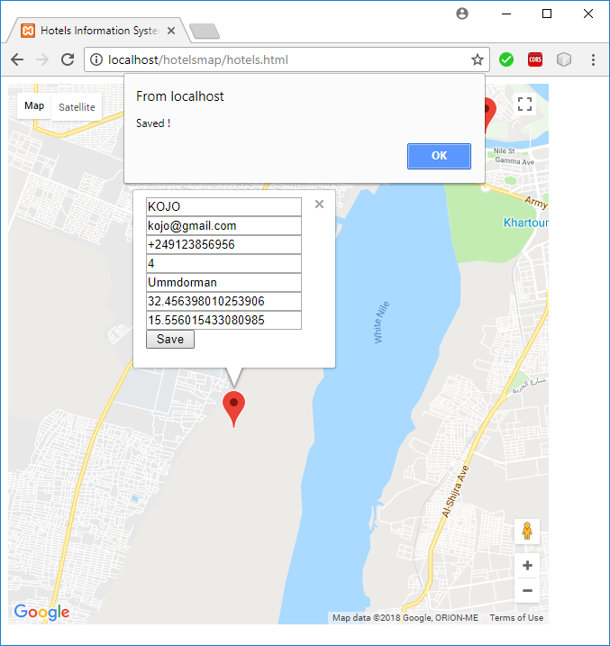{width="554" height="586"}

\
\

7.  

[]{#OLE_LINK5} [[In hotels.html page within createMarker() function
change the update button
to.]{style="background: #ffffff"}]{lang="en-GB"}

[['&lt;input type="button" value="UPDATE"
onclick="updateHotel()"&gt;']{style="background: #f2f4ff"}]{lang="en-GB"}

\
\

[]{#OLE_LINK6} [[And we will create updateHotel() function to send the
changes to the PHP
application.]{style="background: #ffffff"}]{lang="en-GB"}

[***[function]{style="background: #f2f4ff"}***[
updateHotel]{style="background: #f2f4ff"}**[(){]{style="background: #f2f4ff"}**]{lang="en-GB"}

[
]{style="background: #f2f4ff"}[***[var]{style="background: #f2f4ff"}***[
frmData
]{style="background: #f2f4ff"}**[=]{style="background: #f2f4ff"}**[
\$]{style="background: #f2f4ff"}**[(]{style="background: #f2f4ff"}**["\#frmData"]{style="background: #f2f4ff"}**[).]{style="background: #f2f4ff"}**[serializeArray]{style="background: #f2f4ff"}**[();]{style="background: #f2f4ff"}**]{lang="en-GB"}

[
[\$]{lang="en-GB"}**[.]{style="background: #f2f4ff"}**[post]{style="background: #f2f4ff"}**[(]{style="background: #f2f4ff"}**["updateHotel.php"]{style="background: #f2f4ff"}**[,]{style="background: #f2f4ff"}**[
frmData]{style="background: #f2f4ff"}**[,]{style="background: #f2f4ff"}**[
]{style="background: #f2f4ff"}***[function]{style="background: #f2f4ff"}*****[(]{style="background: #f2f4ff"}**[data]{style="background: #f2f4ff"}**[){]{style="background: #f2f4ff"}**]{style="background: #f2f4ff"}

[
[alert]{lang="en-GB"}**[(]{style="background: #f2f4ff"}**[data]{style="background: #f2f4ff"}**[);]{style="background: #f2f4ff"}**]{style="background: #f2f4ff"}

[
]{style="background: #f2f4ff"}[**[});]{style="background: #f2f4ff"}**]{lang="en-GB"}

[**[}]{style="background: #f2f4ff"}**]{lang="en-GB"}

[]{#OLE_LINK7} [[now we will create the updateHotel.php application. And
receive the form date and save changes into hotels table. From file menu
in notepad++ click on new to create a new file and change the language
to PHP. And write the following
code.]{style="background: #ffffff"}]{lang="en-GB"}

[[&lt;?php]{style="background: #fdf8e3"}]{lang="en-GB"}

[[\$ID]{style="background: #fefcf5"}[
]{style="background: #fefcf5"}[=]{style="background: #fefcf5"}[
]{style="background: #fefcf5"}[\$\_POST]{style="background: #fefcf5"}[\[]{style="background: #fefcf5"}['ID']{style="background: #fefcf5"}[\];]{style="background: #fefcf5"}]{lang="en-GB"}

[[\$NAME]{style="background: #fefcf5"}[
]{style="background: #fefcf5"}[=]{style="background: #fefcf5"}[
]{style="background: #fefcf5"}[\$\_POST]{style="background: #fefcf5"}[\[]{style="background: #fefcf5"}['NAME']{style="background: #fefcf5"}[\];]{style="background: #fefcf5"}]{lang="en-GB"}

[[\$EMAIL]{style="background: #fefcf5"}[
]{style="background: #fefcf5"}[=]{style="background: #fefcf5"}[
]{style="background: #fefcf5"}[\$\_POST]{style="background: #fefcf5"}[\[]{style="background: #fefcf5"}['EMAIL']{style="background: #fefcf5"}[\];]{style="background: #fefcf5"}]{lang="en-GB"}

[[\$PHONE]{style="background: #fefcf5"}[
]{style="background: #fefcf5"}[=]{style="background: #fefcf5"}[
]{style="background: #fefcf5"}[\$\_POST]{style="background: #fefcf5"}[\[]{style="background: #fefcf5"}['PHONE']{style="background: #fefcf5"}[\];]{style="background: #fefcf5"}]{lang="en-GB"}

[[\$STARS]{style="background: #fefcf5"}[
]{style="background: #fefcf5"}[=]{style="background: #fefcf5"}[
]{style="background: #fefcf5"}[\$\_POST]{style="background: #fefcf5"}[\[]{style="background: #fefcf5"}['STARS']{style="background: #fefcf5"}[\];]{style="background: #fefcf5"}]{lang="en-GB"}

[[\$DESC]{style="background: #fefcf5"}[
]{style="background: #fefcf5"}[=]{style="background: #fefcf5"}[
]{style="background: #fefcf5"}[\$\_POST]{style="background: #fefcf5"}[\[]{style="background: #fefcf5"}['DESC']{style="background: #fefcf5"}[\];]{style="background: #fefcf5"}]{lang="en-GB"}

[[\$LONGITUDE]{style="background: #fefcf5"}[
]{style="background: #fefcf5"}[=]{style="background: #fefcf5"}[
]{style="background: #fefcf5"}[\$\_POST]{style="background: #fefcf5"}[\[]{style="background: #fefcf5"}['LONGITUDE']{style="background: #fefcf5"}[\];]{style="background: #fefcf5"}]{lang="en-GB"}

[[\$LATITUDE]{style="background: #fefcf5"}[
]{style="background: #fefcf5"}[=]{style="background: #fefcf5"}[
]{style="background: #fefcf5"}[\$\_POST]{style="background: #fefcf5"}[\[]{style="background: #fefcf5"}['LATITUDE']{style="background: #fefcf5"}[\];]{style="background: #fefcf5"}]{lang="en-GB"}

[[\$con]{style="background: #fefcf5"}[
]{style="background: #fefcf5"}[=]{style="background: #fefcf5"}[
]{style="background: #fefcf5"}**[mysqli\_connect]{style="background: #fefcf5"}**[(]{style="background: #fefcf5"}["localhost"]{style="background: #fefcf5"}[,]{style="background: #fefcf5"}["root"]{style="background: #fefcf5"}[,]{style="background: #fefcf5"}["root"]{style="background: #fefcf5"}[,]{style="background: #fefcf5"}["tourism"]{style="background: #fefcf5"}[)]{style="background: #fefcf5"}[
]{style="background: #fefcf5"}**[or]{style="background: #fefcf5"}**[
]{style="background: #fefcf5"}**[die]{style="background: #fefcf5"}**[(]{style="background: #fefcf5"}["Connection
Error !
"]{style="background: #fefcf5"}[);]{style="background: #fefcf5"}]{lang="en-GB"}

[[\$query]{style="background: #fefcf5"}[
]{style="background: #fefcf5"}[=]{style="background: #fefcf5"}[
]{style="background: #fefcf5"}**[mysqli\_query]{style="background: #fefcf5"}**[(]{style="background: #fefcf5"}[\$con]{style="background: #fefcf5"}[
]{style="background: #fefcf5"}[,]{style="background: #fefcf5"}[
]{style="background: #fefcf5"}["UPDATE hotels SET
NAME=']{style="background: #fefcf5"}**[\$NAME]{style="background: #fefcf5"}**[',
DESCRIPTION=']{style="background: #fefcf5"}**[\$DESC]{style="background: #fefcf5"}**[',
PHONE=']{style="background: #fefcf5"}**[\$PHONE]{style="background: #fefcf5"}**[',
EMAIL=']{style="background: #fefcf5"}**[\$EMAIL]{style="background: #fefcf5"}**[',
STARS=']{style="background: #fefcf5"}**[\$STARS]{style="background: #fefcf5"}**[',
LONGITUDE=']{style="background: #fefcf5"}**[\$LONGITUDE]{style="background: #fefcf5"}**[',
LATITUDE=']{style="background: #fefcf5"}**[\$LATITUDE]{style="background: #fefcf5"}**['
WHERE
ID=']{style="background: #fefcf5"}**[\$ID]{style="background: #fefcf5"}**[';"]{style="background: #fefcf5"}[);]{style="background: #fefcf5"}]{lang="en-GB"}

[**[if]{style="background: #fefcf5"}**[(]{style="background: #fefcf5"}[\$query]{style="background: #fefcf5"}[){]{style="background: #fefcf5"}**[echo]{style="background: #fefcf5"}**[
]{style="background: #fefcf5"}["Updated !
"]{style="background: #fefcf5"}[;}]{style="background: #fefcf5"}**[else]{style="background: #fefcf5"}**[{]{style="background: #fefcf5"}**[echo]{style="background: #fefcf5"}**[
]{style="background: #fefcf5"}[" Not Updated !
"]{style="background: #fefcf5"}[;}]{style="background: #fefcf5"}]{lang="en-GB"}

[[?&gt;]{style="background: #fdf8e3"}]{lang="en-GB"}

\
\

[]{#OLE_LINK8} [[Save application in our project folder with
updateHotel.php and open your browser and type the following url in
address bar
]{style="background: #ffffff"}[[http://localhost/hotelsmap/hotels.html]{style="background: #ffffff"}](http://localhost/hotelsmap/hotels.html)[
.]{style="background: #ffffff"}]{lang="en-GB"}

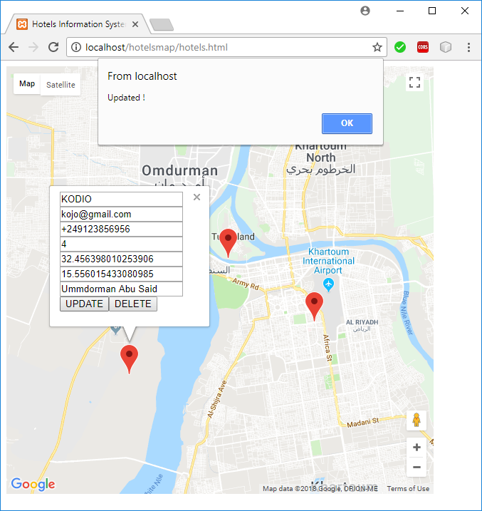{width="554" height="586"}

\
\

8.  

[[In hotels.html page within createMarker() function change the delete
button to.]{style="background: #ffffff"}]{lang="en-GB"}

[['&lt;input type="button" value="DELETE"
onclick="deleteHotel()"&gt;']{style="background: #f2f4ff"}]{lang="en-GB"}

\
\

[[And we will create deleteHotel() function to send the ID of hotels
that we want to delete to the PHP
application.]{style="background: #ffffff"}]{lang="en-GB"}

[***[function]{style="background: #f2f4ff"}***[
deleteHotel]{style="background: #f2f4ff"}**[(){]{style="background: #f2f4ff"}**]{lang="en-GB"}

[
]{style="background: #f2f4ff"}[***[var]{style="background: #f2f4ff"}***[
frmData
]{style="background: #f2f4ff"}**[=]{style="background: #f2f4ff"}**[
\$]{style="background: #f2f4ff"}**[(]{style="background: #f2f4ff"}**["\#frmData"]{style="background: #f2f4ff"}**[).]{style="background: #f2f4ff"}**[serializeArray]{style="background: #f2f4ff"}**[();]{style="background: #f2f4ff"}**]{lang="en-GB"}

[
[\$]{lang="en-GB"}**[.]{style="background: #f2f4ff"}**[post]{style="background: #f2f4ff"}**[(]{style="background: #f2f4ff"}**["deleteHotel.php"]{style="background: #f2f4ff"}**[,]{style="background: #f2f4ff"}**[
frmData]{style="background: #f2f4ff"}**[,]{style="background: #f2f4ff"}**[
]{style="background: #f2f4ff"}***[function]{style="background: #f2f4ff"}*****[(]{style="background: #f2f4ff"}**[data]{style="background: #f2f4ff"}**[){]{style="background: #f2f4ff"}**]{style="background: #f2f4ff"}

[
[alert]{lang="en-GB"}**[(]{style="background: #f2f4ff"}**[data]{style="background: #f2f4ff"}**[);]{style="background: #f2f4ff"}**]{style="background: #f2f4ff"}

[
]{style="background: #f2f4ff"}[**[});]{style="background: #f2f4ff"}**]{lang="en-GB"}

[**[}]{style="background: #f2f4ff"}**]{lang="en-GB"}

\
\

[]{#OLE_LINK9} [[now we will create the deleteHotel.php application. And
receive the form date and save changes into hotels table. From file menu
in notepad++ click on new to create a new file and change the language
to PHP. And write the following
code.]{style="background: #ffffff"}]{lang="en-GB"}

[[&lt;?php]{style="background: #fdf8e3"}]{lang="en-GB"}

[[\$ID]{style="background: #fefcf5"}[
]{style="background: #fefcf5"}[=]{style="background: #fefcf5"}[
]{style="background: #fefcf5"}[\$\_POST]{style="background: #fefcf5"}[\[]{style="background: #fefcf5"}['ID']{style="background: #fefcf5"}[\];]{style="background: #fefcf5"}]{lang="en-GB"}

[[\$con]{style="background: #fefcf5"}[
]{style="background: #fefcf5"}[=]{style="background: #fefcf5"}[
]{style="background: #fefcf5"}**[mysqli\_connect]{style="background: #fefcf5"}**[(]{style="background: #fefcf5"}["localhost"]{style="background: #fefcf5"}[,]{style="background: #fefcf5"}["root"]{style="background: #fefcf5"}[,]{style="background: #fefcf5"}["root"]{style="background: #fefcf5"}[,]{style="background: #fefcf5"}["tourism"]{style="background: #fefcf5"}[)]{style="background: #fefcf5"}[
]{style="background: #fefcf5"}**[or]{style="background: #fefcf5"}**[
]{style="background: #fefcf5"}**[die]{style="background: #fefcf5"}**[(]{style="background: #fefcf5"}["Connection
Error !
"]{style="background: #fefcf5"}[);]{style="background: #fefcf5"}]{lang="en-GB"}

[[\$query]{style="background: #fefcf5"}[
]{style="background: #fefcf5"}[=]{style="background: #fefcf5"}[
]{style="background: #fefcf5"}**[mysqli\_query]{style="background: #fefcf5"}**[(]{style="background: #fefcf5"}[\$con]{style="background: #fefcf5"}[
]{style="background: #fefcf5"}[,]{style="background: #fefcf5"}[
]{style="background: #fefcf5"}["DELETE FROM hotels WHERE
ID=']{style="background: #fefcf5"}**[\$ID]{style="background: #fefcf5"}**[';"]{style="background: #fefcf5"}[);]{style="background: #fefcf5"}]{lang="en-GB"}

[**[if]{style="background: #fefcf5"}**[(]{style="background: #fefcf5"}[\$query]{style="background: #fefcf5"}[){]{style="background: #fefcf5"}**[echo]{style="background: #fefcf5"}**[
]{style="background: #fefcf5"}["Deleted !
"]{style="background: #fefcf5"}[;}]{style="background: #fefcf5"}**[else]{style="background: #fefcf5"}**[{]{style="background: #fefcf5"}**[echo]{style="background: #fefcf5"}**[
]{style="background: #fefcf5"}[" Not Deleted !
"]{style="background: #fefcf5"}[;}]{style="background: #fefcf5"}]{lang="en-GB"}

[[?&gt;]{style="background: #fdf8e3"}]{lang="en-GB"}

[]{#OLE_LINK10} [[Save application in our project folder with
deleteHotel.php and open your browser and type the following url in
address bar
]{style="background: #ffffff"}[[http://localhost/hotelsmap/hotels.html]{style="background: #ffffff"}](http://localhost/hotelsmap/hotels.html)[
.]{style="background: #ffffff"}]{lang="en-GB"}

\
\

\
\

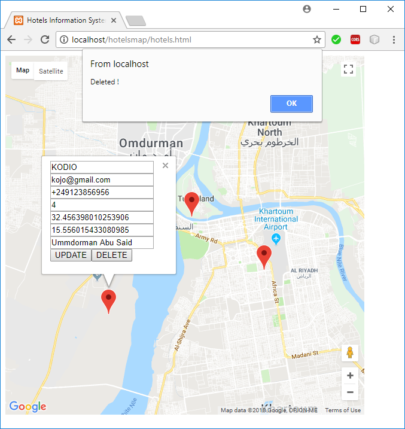{width="554" height="586"}

[[Click on hotel that you want to delete and click on the delete button.
And then click Ok. And refresh your page. You will see the hotel has
been deleted.]{style="background: #ffffff"}]{lang="en-GB"}

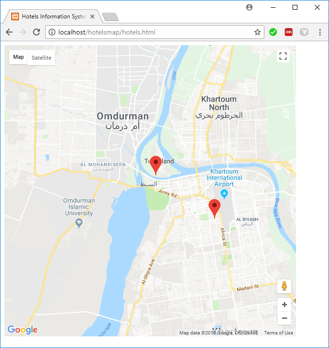{width="554" height="586"}

9.  

[[Now we need to export our information to csv for farther analysis
using excel, SPSS or ArcGIS. We will create a link under the mapDiv
element and this link will open PHP application to export the hotels
information from MySQL database. Under mapDiv add the following HTML
code.]{style="background: #ffffff"}]{lang="en-GB"}

[&lt;a href=**"exportHotels.php"**&gt; **EXPORT DATA to
CSV**&lt;/a&gt;]{lang="en-GB"}

[[Now we will create the exportHotels.php application to export our data
into CSV format for farther analysis. From file menu in notepad++ click
on new to create a new file and change the language to PHP. And write
the following code.]{style="background: #ffffff"}]{lang="en-GB"}

[[&lt;?php]{style="background: #fdf8e3"}]{lang="en-GB"}

[[\$con]{style="background: #fefcf5"}[
]{style="background: #fefcf5"}[=]{style="background: #fefcf5"}[
]{style="background: #fefcf5"}**[mysqli\_connect]{style="background: #fefcf5"}**[(]{style="background: #fefcf5"}["localhost"]{style="background: #fefcf5"}[,]{style="background: #fefcf5"}["root"]{style="background: #fefcf5"}[,]{style="background: #fefcf5"}["root"]{style="background: #fefcf5"}[,]{style="background: #fefcf5"}["tourism"]{style="background: #fefcf5"}[)]{style="background: #fefcf5"}[
]{style="background: #fefcf5"}**[or]{style="background: #fefcf5"}**[
]{style="background: #fefcf5"}**[die]{style="background: #fefcf5"}**[(]{style="background: #fefcf5"}["
Connection Error !
"]{style="background: #fefcf5"}[);]{style="background: #fefcf5"}]{lang="en-GB"}

[[\$query]{style="background: #fefcf5"}[
]{style="background: #fefcf5"}[=]{style="background: #fefcf5"}[
]{style="background: #fefcf5"}**[mysqli\_query]{style="background: #fefcf5"}**[(]{style="background: #fefcf5"}[\$con]{style="background: #fefcf5"}[
]{style="background: #fefcf5"}[,]{style="background: #fefcf5"}[
]{style="background: #fefcf5"}["SELECT \* FROM
hotels;"]{style="background: #fefcf5"}[);]{style="background: #fefcf5"}]{lang="en-GB"}

[[\$temp]{style="background: #fefcf5"}[
]{style="background: #fefcf5"}[=]{style="background: #fefcf5"}[
]{style="background: #fefcf5"}**[Array]{style="background: #fefcf5"}**[();]{style="background: #fefcf5"}]{lang="en-GB"}

[**[while]{style="background: #fefcf5"}**[(]{style="background: #fefcf5"}[\$row]{style="background: #fefcf5"}[
]{style="background: #fefcf5"}[=]{style="background: #fefcf5"}[
]{style="background: #fefcf5"}**[mysqli\_fetch\_assoc]{style="background: #fefcf5"}**[(]{style="background: #fefcf5"}[\$query]{style="background: #fefcf5"}[)){]{style="background: #fefcf5"}]{lang="en-GB"}

[
]{style="background: #fefcf5"}[[\$temp]{style="background: #fefcf5"}[\[\]]{style="background: #fefcf5"}[
]{style="background: #fefcf5"}[=]{style="background: #fefcf5"}[
]{style="background: #fefcf5"}[\$row]{style="background: #fefcf5"}[
]{style="background: #fefcf5"}[;]{style="background: #fefcf5"}]{lang="en-GB"}

[[}]{style="background: #fefcf5"}]{lang="en-GB"}

[**[header]{style="background: #fefcf5"}**[(]{style="background: #fefcf5"}['Content-Type:
text/csv; charset=utf-8;
encoding=UTF-8']{style="background: #fefcf5"}[);]{style="background: #fefcf5"}]{lang="en-GB"}

[**[header]{style="background: #fefcf5"}**[(]{style="background: #fefcf5"}['Content-Disposition:
attachment;
filename=hotels.csv']{style="background: #fefcf5"}[);]{style="background: #fefcf5"}]{lang="en-GB"}

[[\$output]{style="background: #fefcf5"}[
]{style="background: #fefcf5"}[=]{style="background: #fefcf5"}[
]{style="background: #fefcf5"}**[fopen]{style="background: #fefcf5"}**[(]{style="background: #fefcf5"}[']{style="background: #fefcf5"}php://output[']{style="background: #fefcf5"}[,]{style="background: #fefcf5"}[
]{style="background: #fefcf5"}['w']{style="background: #fefcf5"}[);]{style="background: #fefcf5"}]{lang="en-GB"}

[**[fputcsv]{style="background: #fefcf5"}**[(]{style="background: #fefcf5"}[\$output]{style="background: #fefcf5"}[,]{style="background: #fefcf5"}[
]{style="background: #fefcf5"}**[array]{style="background: #fefcf5"}**[(]{style="background: #fefcf5"}['ID']{style="background: #fefcf5"}[,]{style="background: #fefcf5"}['NAME']{style="background: #fefcf5"}[,]{style="background: #fefcf5"}['DESCRIPTION']{style="background: #fefcf5"}[,]{style="background: #fefcf5"}['PHONE']{style="background: #fefcf5"}[,]{style="background: #fefcf5"}['EMAIL']{style="background: #fefcf5"}[,]{style="background: #fefcf5"}[
]{style="background: #fefcf5"}['STARS']{style="background: #fefcf5"}[,]{style="background: #fefcf5"}['LONG']{style="background: #fefcf5"}[,]{style="background: #fefcf5"}['LAT']{style="background: #fefcf5"}[));]{style="background: #fefcf5"}]{lang="en-GB"}

[**[if]{style="background: #fefcf5"}**[
]{style="background: #fefcf5"}[(]{style="background: #fefcf5"}**[count]{style="background: #fefcf5"}**[(]{style="background: #fefcf5"}[\$temp]{style="background: #fefcf5"}[)]{style="background: #fefcf5"}[
]{style="background: #fefcf5"}[&gt;]{style="background: #fefcf5"}[
]{style="background: #fefcf5"}[0]{style="background: #fefcf5"}[)]{style="background: #fefcf5"}[
]{style="background: #fefcf5"}[{]{style="background: #fefcf5"}]{lang="en-GB"}

[
]{style="background: #fefcf5"}[**[foreach]{style="background: #fefcf5"}**[
]{style="background: #fefcf5"}[(]{style="background: #fefcf5"}[\$temp]{style="background: #fefcf5"}[
]{style="background: #fefcf5"}**[as]{style="background: #fefcf5"}**[
]{style="background: #fefcf5"}[\$row]{style="background: #fefcf5"}[)]{style="background: #fefcf5"}[
]{style="background: #fefcf5"}[{]{style="background: #fefcf5"}]{lang="en-GB"}

[
]{style="background: #fefcf5"}[**[fputcsv]{style="background: #fefcf5"}**[(]{style="background: #fefcf5"}[\$output]{style="background: #fefcf5"}[,]{style="background: #fefcf5"}[
]{style="background: #fefcf5"}[\$row]{style="background: #fefcf5"}[);]{style="background: #fefcf5"}]{lang="en-GB"}

[
]{style="background: #fefcf5"}[[}]{style="background: #fefcf5"}]{lang="en-GB"}

[[}]{style="background: #fefcf5"}]{lang="en-GB"}

[[?&gt;]{style="background: #fdf8e3"}]{lang="en-GB"}

\
\

[[Save the application with exportHotels.php and type the following URL
in your browser address bar
]{style="background: #ffffff"}[[http://localhost/hotelsmap/hotels.html]{style="background: #ffffff"}](http://localhost/hotelsmap/hotels.html)[
.]{style="background: #ffffff"}]{lang="en-GB"}

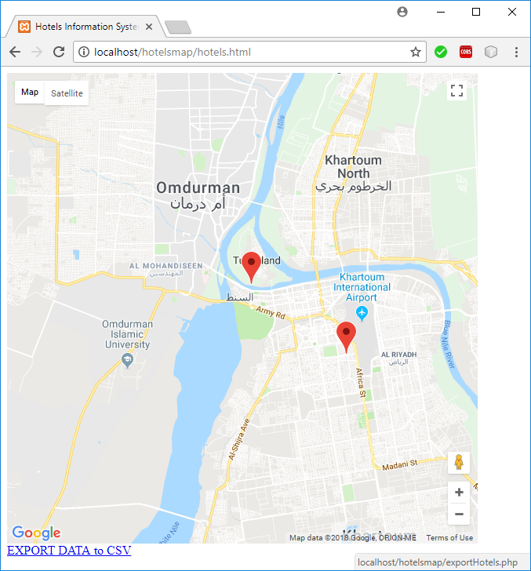{width="554" height="595"}

[[Click on the EXPORT DATA to CSV link. The download of data will start
and you can open the downloaded CSV file using
Excel.]{style="background: #ffffff"}]{lang="en-GB"}

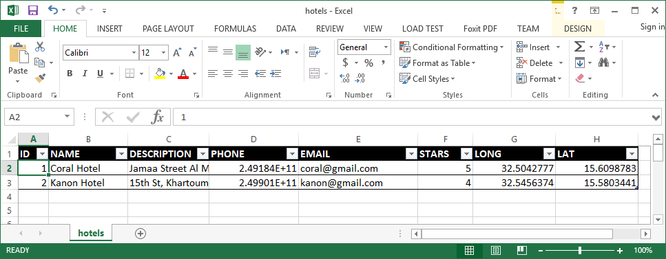{width="554" height="216"}

\
\

2.  

\
\

1.  

[[&lt;?php]{style="background: #fdf8e3"}]{lang="en-GB"}

[[\$con]{style="background: #fefcf5"}[
]{style="background: #fefcf5"}[=]{style="background: #fefcf5"}[
]{style="background: #fefcf5"}**[mysqli\_connect]{style="background: #fefcf5"}**[(]{style="background: #fefcf5"}["localhost"]{style="background: #fefcf5"}[,]{style="background: #fefcf5"}["root"]{style="background: #fefcf5"}[,]{style="background: #fefcf5"}["root"]{style="background: #fefcf5"}[,]{style="background: #fefcf5"}["tourism"]{style="background: #fefcf5"}[)]{style="background: #fefcf5"}[
]{style="background: #fefcf5"}]{lang="en-GB"}

[ ]{style="background: #fefcf5"}[**[or]{style="background: #fefcf5"}**[
]{style="background: #fefcf5"}**[die]{style="background: #fefcf5"}**[(]{style="background: #fefcf5"}["
Connection Error !
"]{style="background: #fefcf5"}[);]{style="background: #fefcf5"}]{lang="en-GB"}

[ ]{style="background: #fefcf5"}

[[\$query]{style="background: #fefcf5"}[
]{style="background: #fefcf5"}[=]{style="background: #fefcf5"}[
]{style="background: #fefcf5"}**[mysqli\_query]{style="background: #fefcf5"}**[(]{style="background: #fefcf5"}[\$con]{style="background: #fefcf5"}[
]{style="background: #fefcf5"}[,]{style="background: #fefcf5"}[
]{style="background: #fefcf5"}["SELECT \* FROM
hotels;"]{style="background: #fefcf5"}[);]{style="background: #fefcf5"}]{lang="en-GB"}

[[\$temp]{style="background: #fefcf5"}[
]{style="background: #fefcf5"}[=]{style="background: #fefcf5"}[
]{style="background: #fefcf5"}**[Array]{style="background: #fefcf5"}**[();]{style="background: #fefcf5"}]{lang="en-GB"}

[**[while]{style="background: #fefcf5"}**[(]{style="background: #fefcf5"}[\$row]{style="background: #fefcf5"}[
]{style="background: #fefcf5"}[=]{style="background: #fefcf5"}[
]{style="background: #fefcf5"}**[mysqli\_fetch\_assoc]{style="background: #fefcf5"}**[(]{style="background: #fefcf5"}[\$query]{style="background: #fefcf5"}[)){]{style="background: #fefcf5"}]{lang="en-GB"}

[
]{style="background: #fefcf5"}[[\$temp]{style="background: #fefcf5"}[\[\]]{style="background: #fefcf5"}[
]{style="background: #fefcf5"}[=]{style="background: #fefcf5"}[
]{style="background: #fefcf5"}[\$row]{style="background: #fefcf5"}[
]{style="background: #fefcf5"}[;]{style="background: #fefcf5"}]{lang="en-GB"}

[[}]{style="background: #fefcf5"}]{lang="en-GB"}

[**[echo]{style="background: #fefcf5"}**[
]{style="background: #fefcf5"}**[json\_encode]{style="background: #fefcf5"}**[(]{style="background: #fefcf5"}[\$temp]{style="background: #fefcf5"}[);]{style="background: #fefcf5"}]{lang="en-GB"}

[[?&gt;]{style="background: #fdf8e3"}]{lang="en-GB"}

2.  

[&lt;html&gt;]{lang="en-GB"}

[&lt;head&gt;]{lang="en-GB"}

[&lt;title&gt; **Hotels Information System**
&lt;/title&gt;]{lang="en-GB"}

[]{#_GoBack} [&lt;script
src=**"https://maps.googleapis.com/maps/api/js?key=AIzaSyDacd2StMFpb4xOdQk2Gg5Gk-CjJoc"**&gt;&lt;/script&gt;]{lang="en-GB"}

[&lt;script
src=**"https://ajax.googleapis.com/ajax/libs/jquery/3.3.1/jquery.min.js"**&gt;&lt;/script&gt;]{lang="en-GB"}

[&lt;script&gt;]{lang="en-GB"}

[***[function]{style="background: #f2f4ff"}***[
createMarker]{style="background: #f2f4ff"}**[(]{style="background: #f2f4ff"}**[latlng]{style="background: #f2f4ff"}**[,]{style="background: #f2f4ff"}**[
hdata]{style="background: #f2f4ff"}**[){]{style="background: #f2f4ff"}**]{lang="en-GB"}

[
]{style="background: #f2f4ff"}[***[var]{style="background: #f2f4ff"}***[
mark ]{style="background: #f2f4ff"}**[=]{style="background: #f2f4ff"}**[
]{style="background: #f2f4ff"}***[new]{style="background: #f2f4ff"}***[
google.maps.Marker]{style="background: #f2f4ff"}**[({]{style="background: #f2f4ff"}**[map]{style="background: #f2f4ff"}**[:]{style="background: #f2f4ff"}**[map]{style="background: #f2f4ff"}**[,]{style="background: #f2f4ff"}**[
position]{style="background: #f2f4ff"}**[:]{style="background: #f2f4ff"}**[latlng]{style="background: #f2f4ff"}**[,]{style="background: #f2f4ff"}**[
title]{style="background: #f2f4ff"}**[:]{style="background: #f2f4ff"}**[hdata.NAME]{style="background: #f2f4ff"}**[});]{style="background: #f2f4ff"}**]{lang="en-GB"}

[
[google.maps.event.addDomListener]{lang="en-GB"}**[(]{style="background: #f2f4ff"}**[mark]{style="background: #f2f4ff"}**[,]{style="background: #f2f4ff"}**[
]{style="background: #f2f4ff"}['click']{style="background: #f2f4ff"}**[,]{style="background: #f2f4ff"}**[
]{style="background: #f2f4ff"}***[function]{style="background: #f2f4ff"}*****[(]{style="background: #f2f4ff"}**[evt]{style="background: #f2f4ff"}**[){]{style="background: #f2f4ff"}**]{style="background: #f2f4ff"}

[ [info ]{lang="en-GB"}**[=]{style="background: #f2f4ff"}**[
]{style="background: #f2f4ff"}***[new]{style="background: #f2f4ff"}***[
google.maps.InfoWindow]{style="background: #f2f4ff"}**[();]{style="background: #f2f4ff"}**]{style="background: #f2f4ff"}

[
]{style="background: #f2f4ff"}[***[var]{style="background: #f2f4ff"}***[
i ]{style="background: #f2f4ff"}**[=]{style="background: #f2f4ff"}**[
]{style="background: #f2f4ff"}['&lt;form
id="frmData"&gt;']{style="background: #f2f4ff"}[
]{style="background: #f2f4ff"}**[+]{style="background: #f2f4ff"}**]{lang="en-GB"}

[ ]{style="background: #f2f4ff"}[['&lt;input type="hidden" name="ID"
value="']{style="background: #f2f4ff"}**[+]{style="background: #f2f4ff"}**[
hdata.ID
]{style="background: #f2f4ff"}**[+]{style="background: #f2f4ff"}**['"&gt;']{style="background: #f2f4ff"}[
]{style="background: #f2f4ff"}**[+]{style="background: #f2f4ff"}**[
]{style="background: #f2f4ff"}]{lang="en-GB"}

[ ]{style="background: #f2f4ff"}[['&lt;input type="text" name="NAME"
value="']{style="background: #f2f4ff"}**[+]{style="background: #f2f4ff"}**[
hdata.NAME
]{style="background: #f2f4ff"}**[+]{style="background: #f2f4ff"}**['"&gt;&lt;br/&gt;']{style="background: #f2f4ff"}[
]{style="background: #f2f4ff"}**[+]{style="background: #f2f4ff"}**]{lang="en-GB"}

[ ]{style="background: #f2f4ff"}[['&lt;input type="text" name="EMAIL"
value="']{style="background: #f2f4ff"}**[+]{style="background: #f2f4ff"}**[
hdata.EMAIL
]{style="background: #f2f4ff"}**[+]{style="background: #f2f4ff"}**['"&gt;&lt;br/&gt;']{style="background: #f2f4ff"}[
]{style="background: #f2f4ff"}**[+]{style="background: #f2f4ff"}**]{lang="en-GB"}

[ ]{style="background: #f2f4ff"}[['&lt;input type="text" name="PHONE"
value="']{style="background: #f2f4ff"}**[+]{style="background: #f2f4ff"}**[
hdata.PHONE
]{style="background: #f2f4ff"}**[+]{style="background: #f2f4ff"}**['"&gt;&lt;br/&gt;']{style="background: #f2f4ff"}[
]{style="background: #f2f4ff"}**[+]{style="background: #f2f4ff"}**]{lang="en-GB"}

[ ]{style="background: #f2f4ff"}[['&lt;input type="text" name="STARS"
value="']{style="background: #f2f4ff"}**[+]{style="background: #f2f4ff"}**[
hdata.STARS
]{style="background: #f2f4ff"}**[+]{style="background: #f2f4ff"}**['"&gt;&lt;br/&gt;']{style="background: #f2f4ff"}[
]{style="background: #f2f4ff"}**[+]{style="background: #f2f4ff"}**]{lang="en-GB"}

[ ]{style="background: #f2f4ff"}[['&lt;input type="text"
name="LONGITUDE"
value="']{style="background: #f2f4ff"}**[+]{style="background: #f2f4ff"}**[
hdata.LONGITUDE
]{style="background: #f2f4ff"}**[+]{style="background: #f2f4ff"}**['"&gt;&lt;br/&gt;']{style="background: #f2f4ff"}[
]{style="background: #f2f4ff"}**[+]{style="background: #f2f4ff"}**]{lang="en-GB"}

[ ]{style="background: #f2f4ff"}[['&lt;input type="text" name="LATITUDE"
value="']{style="background: #f2f4ff"}**[+]{style="background: #f2f4ff"}**[
hdata.LATITUDE
]{style="background: #f2f4ff"}**[+]{style="background: #f2f4ff"}**['"&gt;&lt;br/&gt;']{style="background: #f2f4ff"}[
]{style="background: #f2f4ff"}**[+]{style="background: #f2f4ff"}**]{lang="en-GB"}

[ ]{style="background: #f2f4ff"}[['&lt;input type="text" name="DESC"
value="']{style="background: #f2f4ff"}**[+]{style="background: #f2f4ff"}**[
hdata.DESCRIPTION
]{style="background: #f2f4ff"}**[+]{style="background: #f2f4ff"}**['"&gt;&lt;br/&gt;']{style="background: #f2f4ff"}[
]{style="background: #f2f4ff"}**[+]{style="background: #f2f4ff"}**]{lang="en-GB"}

[ ]{style="background: #f2f4ff"}[['&lt;input type="button"
value="UPDATE"
onclick="updateHotel()"&gt;']{style="background: #f2f4ff"}[
]{style="background: #f2f4ff"}**[+]{style="background: #f2f4ff"}**[
]{style="background: #f2f4ff"}]{lang="en-GB"}

[ ]{style="background: #f2f4ff"}[['&lt;input type="button"
value="DELETE"
onclick="deletHotel()"&gt;']{style="background: #f2f4ff"}[
]{style="background: #f2f4ff"}**[+]{style="background: #f2f4ff"}**[
]{style="background: #f2f4ff"}]{lang="en-GB"}

[
]{style="background: #f2f4ff"}[['&lt;/form&gt;']{style="background: #f2f4ff"}**[;]{style="background: #f2f4ff"}**]{lang="en-GB"}

[
[info.setContent]{lang="en-GB"}**[(]{style="background: #f2f4ff"}**['']{style="background: #f2f4ff"}[
]{style="background: #f2f4ff"}**[+]{style="background: #f2f4ff"}**[
i]{style="background: #f2f4ff"}**[);]{style="background: #f2f4ff"}**]{style="background: #f2f4ff"}

[ [info.open]{lang="en-GB"}**[(]{style="background: #f2f4ff"}**[map
]{style="background: #f2f4ff"}**[,]{style="background: #f2f4ff"}**[
mark]{style="background: #f2f4ff"}**[);]{style="background: #f2f4ff"}**]{style="background: #f2f4ff"}

[
]{style="background: #f2f4ff"}[**[});]{style="background: #f2f4ff"}**]{lang="en-GB"}

[**[}]{style="background: #f2f4ff"}**]{lang="en-GB"}

[***[function]{style="background: #f2f4ff"}***[
loadMap]{style="background: #f2f4ff"}**[(){]{style="background: #f2f4ff"}**]{lang="en-GB"}

[
]{style="background: #f2f4ff"}[***[var]{style="background: #f2f4ff"}***[
mapOption
]{style="background: #f2f4ff"}**[=]{style="background: #f2f4ff"}**[
]{style="background: #f2f4ff"}**[{]{style="background: #f2f4ff"}**]{lang="en-GB"}

[
[center]{lang="en-GB"}**[:]{style="background: #f2f4ff"}*****[new]{style="background: #f2f4ff"}***[
google.maps.LatLng]{style="background: #f2f4ff"}**[(]{style="background: #f2f4ff"}**[15.6]{style="background: #f2f4ff"}**[,]{style="background: #f2f4ff"}**[
]{style="background: #f2f4ff"}[32.5]{style="background: #f2f4ff"}**[),]{style="background: #f2f4ff"}**[
]{style="background: #f2f4ff"}]{style="background: #f2f4ff"}

[
[zoom]{lang="en-GB"}**[:]{style="background: #f2f4ff"}**[12]{style="background: #f2f4ff"}**[,]{style="background: #f2f4ff"}**]{style="background: #f2f4ff"}

[
[mapTypeId]{lang="en-GB"}**[:]{style="background: #f2f4ff"}**[google.maps.MapTypeId.ROAD]{style="background: #f2f4ff"}]{style="background: #f2f4ff"}

[
]{style="background: #f2f4ff"}[**[};]{style="background: #f2f4ff"}**]{lang="en-GB"}

[ [map ]{lang="en-GB"}**[=]{style="background: #f2f4ff"}**[
]{style="background: #f2f4ff"}***[new]{style="background: #f2f4ff"}***[
google.maps.Map]{style="background: #f2f4ff"}**[(]{style="background: #f2f4ff"}**[document.getElementById]{style="background: #f2f4ff"}**[(]{style="background: #f2f4ff"}**['mapDiv']{style="background: #f2f4ff"}**[),]{style="background: #f2f4ff"}**[
mapOption]{style="background: #f2f4ff"}**[);]{style="background: #f2f4ff"}**]{style="background: #f2f4ff"}

[
]{style="background: #f2f4ff"}[***[var]{style="background: #f2f4ff"}***[
hotelsData
]{style="background: #f2f4ff"}**[;]{style="background: #f2f4ff"}**]{lang="en-GB"}

[
[\$]{lang="en-GB"}**[.]{style="background: #f2f4ff"}**[post]{style="background: #f2f4ff"}**[(]{style="background: #f2f4ff"}**['getHotels.php']{style="background: #f2f4ff"}**[,]{style="background: #f2f4ff"}**[
]{style="background: #f2f4ff"}***[function]{style="background: #f2f4ff"}*****[(]{style="background: #f2f4ff"}**[data]{style="background: #f2f4ff"}**[){]{style="background: #f2f4ff"}**]{style="background: #f2f4ff"}

[ [hotelsData ]{lang="en-GB"}**[=]{style="background: #f2f4ff"}**[
JSON.parse]{style="background: #f2f4ff"}**[(]{style="background: #f2f4ff"}**[data]{style="background: #f2f4ff"}**[);]{style="background: #f2f4ff"}**]{style="background: #f2f4ff"}

[
]{style="background: #f2f4ff"}[***[for]{style="background: #f2f4ff"}*****[(]{style="background: #f2f4ff"}**[i
]{style="background: #f2f4ff"}**[=]{style="background: #f2f4ff"}**[
]{style="background: #f2f4ff"}[0]{style="background: #f2f4ff"}[
]{style="background: #f2f4ff"}**[;]{style="background: #f2f4ff"}**[ i
]{style="background: #f2f4ff"}**[&lt;]{style="background: #f2f4ff"}**[
hotelsData.length]{style="background: #f2f4ff"}**[;]{style="background: #f2f4ff"}**[
i]{style="background: #f2f4ff"}**[++){]{style="background: #f2f4ff"}**]{lang="en-GB"}

[
]{style="background: #f2f4ff"}[***[var]{style="background: #f2f4ff"}***[
latlng
]{style="background: #f2f4ff"}**[=]{style="background: #f2f4ff"}**[
]{style="background: #f2f4ff"}***[new]{style="background: #f2f4ff"}***[
google.maps.LatLng]{style="background: #f2f4ff"}**[(]{style="background: #f2f4ff"}**[hotelsData]{style="background: #f2f4ff"}**[\[]{style="background: #f2f4ff"}**[i]{style="background: #f2f4ff"}**[\].]{style="background: #f2f4ff"}**[LATITUDE]{style="background: #f2f4ff"}**[,]{style="background: #f2f4ff"}**[
hotelsData]{style="background: #f2f4ff"}**[\[]{style="background: #f2f4ff"}**[i]{style="background: #f2f4ff"}**[\].]{style="background: #f2f4ff"}**[LONGITUDE]{style="background: #f2f4ff"}**[);]{style="background: #f2f4ff"}**]{lang="en-GB"}

[
]{style="background: #f2f4ff"}[***[var]{style="background: #f2f4ff"}***[
hdata
]{style="background: #f2f4ff"}**[=]{style="background: #f2f4ff"}**[
hotelsData]{style="background: #f2f4ff"}**[\[]{style="background: #f2f4ff"}**[i]{style="background: #f2f4ff"}**[\];]{style="background: #f2f4ff"}**]{lang="en-GB"}

[
[createMarker]{lang="en-GB"}**[(]{style="background: #f2f4ff"}**[latlng]{style="background: #f2f4ff"}**[,]{style="background: #f2f4ff"}**[
hdata]{style="background: #f2f4ff"}**[);]{style="background: #f2f4ff"}**]{style="background: #f2f4ff"}

[
]{style="background: #f2f4ff"}[**[}]{style="background: #f2f4ff"}**]{lang="en-GB"}

[
]{style="background: #f2f4ff"}[**[});]{style="background: #f2f4ff"}**]{lang="en-GB"}

[
[newHotel]{lang="en-GB"}**[();]{style="background: #f2f4ff"}**]{style="background: #f2f4ff"}

[**[}]{style="background: #f2f4ff"}**]{lang="en-GB"}

[***[function]{style="background: #f2f4ff"}***[
newHotel]{style="background: #f2f4ff"}**[(){]{style="background: #f2f4ff"}**]{lang="en-GB"}

[
[google.maps.event.addDomListener]{lang="en-GB"}**[(]{style="background: #f2f4ff"}**[map]{style="background: #f2f4ff"}**[,]{style="background: #f2f4ff"}**[
]{style="background: #f2f4ff"}['click']{style="background: #f2f4ff"}**[,]{style="background: #f2f4ff"}**[
]{style="background: #f2f4ff"}***[function]{style="background: #f2f4ff"}*****[(]{style="background: #f2f4ff"}**[evt]{style="background: #f2f4ff"}**[){]{style="background: #f2f4ff"}**]{style="background: #f2f4ff"}

[
]{style="background: #f2f4ff"}[***[var]{style="background: #f2f4ff"}***[
pos ]{style="background: #f2f4ff"}**[=]{style="background: #f2f4ff"}**[
]{style="background: #f2f4ff"}***[new]{style="background: #f2f4ff"}***[
google.maps.LatLng]{style="background: #f2f4ff"}**[(]{style="background: #f2f4ff"}**[evt.latLng.lat]{style="background: #f2f4ff"}**[(),]{style="background: #f2f4ff"}**[
evt.latLng.lng]{style="background: #f2f4ff"}**[());]{style="background: #f2f4ff"}**]{lang="en-GB"}

[
]{style="background: #f2f4ff"}[***[var]{style="background: #f2f4ff"}***[
mark ]{style="background: #f2f4ff"}**[=]{style="background: #f2f4ff"}**[
]{style="background: #f2f4ff"}***[new]{style="background: #f2f4ff"}***[
google.maps.Marker]{style="background: #f2f4ff"}**[({]{style="background: #f2f4ff"}**[map]{style="background: #f2f4ff"}**[:]{style="background: #f2f4ff"}**[map]{style="background: #f2f4ff"}**[,]{style="background: #f2f4ff"}**[
position]{style="background: #f2f4ff"}**[:]{style="background: #f2f4ff"}**[pos]{style="background: #f2f4ff"}**[});]{style="background: #f2f4ff"}**]{lang="en-GB"}

[
]{style="background: #f2f4ff"}[***[var]{style="background: #f2f4ff"}***[
info ]{style="background: #f2f4ff"}**[=]{style="background: #f2f4ff"}**[
]{style="background: #f2f4ff"}***[new]{style="background: #f2f4ff"}***[
google.maps.InfoWindow]{style="background: #f2f4ff"}**[();]{style="background: #f2f4ff"}**]{lang="en-GB"}

[
[info.setContent]{lang="en-GB"}**[(]{style="background: #f2f4ff"}**['&lt;form
id="frm"&gt;']{style="background: #f2f4ff"}[
]{style="background: #f2f4ff"}**[+]{style="background: #f2f4ff"}**]{style="background: #f2f4ff"}

[ ]{style="background: #f2f4ff"}[['&lt;input type="text" name="NAME"
placeholder="Name ..."&gt;&lt;br/&gt;']{style="background: #f2f4ff"}[
]{style="background: #f2f4ff"}**[+]{style="background: #f2f4ff"}**[
]{style="background: #f2f4ff"}]{lang="en-GB"}

[ ]{style="background: #f2f4ff"}[['&lt;input type="text" name="EMAIL"
placeholder="Email ..."&gt;&lt;br/&gt;']{style="background: #f2f4ff"}[
]{style="background: #f2f4ff"}**[+]{style="background: #f2f4ff"}**[
]{style="background: #f2f4ff"}]{lang="en-GB"}

[ ]{style="background: #f2f4ff"}[['&lt;input type="text" name="PHONE"
placeholder="Phone ..."&gt;&lt;br/&gt;']{style="background: #f2f4ff"}[
]{style="background: #f2f4ff"}**[+]{style="background: #f2f4ff"}**[
]{style="background: #f2f4ff"}]{lang="en-GB"}

[ ]{style="background: #f2f4ff"}[['&lt;input type="text" name="STARS"
placeholder="Stars ..."&gt;&lt;br/&gt;']{style="background: #f2f4ff"}[
]{style="background: #f2f4ff"}**[+]{style="background: #f2f4ff"}**[
]{style="background: #f2f4ff"}]{lang="en-GB"}

[ ]{style="background: #f2f4ff"}[['&lt;input type="text" name="DESC"
placeholder="Description
..."&gt;&lt;br/&gt;']{style="background: #f2f4ff"}[
]{style="background: #f2f4ff"}**[+]{style="background: #f2f4ff"}**[
]{style="background: #f2f4ff"}]{lang="en-GB"}

[ ]{style="background: #f2f4ff"}[['&lt;input type="text"
name="LONGITUDE"
value="']{style="background: #f2f4ff"}**[+]{style="background: #f2f4ff"}**[
evt.latLng.lng]{style="background: #f2f4ff"}**[()]{style="background: #f2f4ff"}**[
]{style="background: #f2f4ff"}**[+]{style="background: #f2f4ff"}**['"&gt;&lt;br/&gt;']{style="background: #f2f4ff"}[
]{style="background: #f2f4ff"}**[+]{style="background: #f2f4ff"}**[
]{style="background: #f2f4ff"}]{lang="en-GB"}

[ ]{style="background: #f2f4ff"}[['&lt;input type="text" name="LATITUDE"
value="']{style="background: #f2f4ff"}**[+]{style="background: #f2f4ff"}**[
evt.latLng.lat]{style="background: #f2f4ff"}**[()]{style="background: #f2f4ff"}**[
]{style="background: #f2f4ff"}**[+]{style="background: #f2f4ff"}**['"&gt;&lt;br/&gt;']{style="background: #f2f4ff"}[
]{style="background: #f2f4ff"}**[+]{style="background: #f2f4ff"}**]{lang="en-GB"}

[ ]{style="background: #f2f4ff"}[['&lt;input type="button" value=" Save
"
onclick="saveHotel();"&gt;&lt;/form&gt;']{style="background: #f2f4ff"}]{lang="en-GB"}

[
]{style="background: #f2f4ff"}[**[);]{style="background: #f2f4ff"}**]{lang="en-GB"}

[
[info.open]{lang="en-GB"}**[(]{style="background: #f2f4ff"}**[map]{style="background: #f2f4ff"}**[,]{style="background: #f2f4ff"}**[
mark]{style="background: #f2f4ff"}**[);]{style="background: #f2f4ff"}**]{style="background: #f2f4ff"}

[
]{style="background: #f2f4ff"}[**[});]{style="background: #f2f4ff"}**]{lang="en-GB"}

[**[}]{style="background: #f2f4ff"}**]{lang="en-GB"}

[***[function]{style="background: #f2f4ff"}***[
saveHotel]{style="background: #f2f4ff"}**[(){]{style="background: #f2f4ff"}**]{lang="en-GB"}

[
]{style="background: #f2f4ff"}[***[var]{style="background: #f2f4ff"}***[
frm ]{style="background: #f2f4ff"}**[=]{style="background: #f2f4ff"}**[
\$]{style="background: #f2f4ff"}**[(]{style="background: #f2f4ff"}**["\#frm"]{style="background: #f2f4ff"}**[).]{style="background: #f2f4ff"}**[serializeArray]{style="background: #f2f4ff"}**[();]{style="background: #f2f4ff"}**]{lang="en-GB"}

[
[\$]{lang="en-GB"}**[.]{style="background: #f2f4ff"}**[post]{style="background: #f2f4ff"}**[(]{style="background: #f2f4ff"}**["addHotel.php"]{style="background: #f2f4ff"}[
]{style="background: #f2f4ff"}**[,]{style="background: #f2f4ff"}**[
frm]{style="background: #f2f4ff"}**[,]{style="background: #f2f4ff"}**[
]{style="background: #f2f4ff"}***[function]{style="background: #f2f4ff"}*****[(]{style="background: #f2f4ff"}**[data]{style="background: #f2f4ff"}**[){]{style="background: #f2f4ff"}**]{style="background: #f2f4ff"}

[
[alert]{lang="en-GB"}**[(]{style="background: #f2f4ff"}**[data]{style="background: #f2f4ff"}**[);]{style="background: #f2f4ff"}**]{style="background: #f2f4ff"}

[
]{style="background: #f2f4ff"}[**[});]{style="background: #f2f4ff"}**]{lang="en-GB"}

[**[}]{style="background: #f2f4ff"}**]{lang="en-GB"}

[***[function]{style="background: #f2f4ff"}***[
updateHotel]{style="background: #f2f4ff"}**[(){]{style="background: #f2f4ff"}**]{lang="en-GB"}

[
]{style="background: #f2f4ff"}[***[var]{style="background: #f2f4ff"}***[
frmData
]{style="background: #f2f4ff"}**[=]{style="background: #f2f4ff"}**[
\$]{style="background: #f2f4ff"}**[(]{style="background: #f2f4ff"}**["\#frmData"]{style="background: #f2f4ff"}**[).]{style="background: #f2f4ff"}**[serializeArray]{style="background: #f2f4ff"}**[();]{style="background: #f2f4ff"}**]{lang="en-GB"}

[
[\$]{lang="en-GB"}**[.]{style="background: #f2f4ff"}**[post]{style="background: #f2f4ff"}**[(]{style="background: #f2f4ff"}**["updateHotel.php"]{style="background: #f2f4ff"}**[,]{style="background: #f2f4ff"}**[
frmData]{style="background: #f2f4ff"}**[,]{style="background: #f2f4ff"}**[
]{style="background: #f2f4ff"}***[function]{style="background: #f2f4ff"}*****[(]{style="background: #f2f4ff"}**[data]{style="background: #f2f4ff"}**[){]{style="background: #f2f4ff"}**]{style="background: #f2f4ff"}

[
[alert]{lang="en-GB"}**[(]{style="background: #f2f4ff"}**[data]{style="background: #f2f4ff"}**[);]{style="background: #f2f4ff"}**]{style="background: #f2f4ff"}

[
]{style="background: #f2f4ff"}[**[});]{style="background: #f2f4ff"}**]{lang="en-GB"}

[**[}]{style="background: #f2f4ff"}**]{lang="en-GB"}

[***[function]{style="background: #f2f4ff"}***[
deletHotel]{style="background: #f2f4ff"}**[(){]{style="background: #f2f4ff"}**]{lang="en-GB"}

[
]{style="background: #f2f4ff"}[***[var]{style="background: #f2f4ff"}***[
frmData
]{style="background: #f2f4ff"}**[=]{style="background: #f2f4ff"}**[
\$]{style="background: #f2f4ff"}**[(]{style="background: #f2f4ff"}**["\#frmData"]{style="background: #f2f4ff"}**[).]{style="background: #f2f4ff"}**[serializeArray]{style="background: #f2f4ff"}**[();]{style="background: #f2f4ff"}**]{lang="en-GB"}

[
[\$]{lang="en-GB"}**[.]{style="background: #f2f4ff"}**[post]{style="background: #f2f4ff"}**[(]{style="background: #f2f4ff"}**["deleteHotel.php"]{style="background: #f2f4ff"}**[,]{style="background: #f2f4ff"}**[
frmData]{style="background: #f2f4ff"}**[,]{style="background: #f2f4ff"}**[
]{style="background: #f2f4ff"}***[function]{style="background: #f2f4ff"}*****[(]{style="background: #f2f4ff"}**[data]{style="background: #f2f4ff"}**[){]{style="background: #f2f4ff"}**]{style="background: #f2f4ff"}

[
[alert]{lang="en-GB"}**[(]{style="background: #f2f4ff"}**[data]{style="background: #f2f4ff"}**[);]{style="background: #f2f4ff"}**]{style="background: #f2f4ff"}

[
]{style="background: #f2f4ff"}[**[});]{style="background: #f2f4ff"}**]{lang="en-GB"}

[**[}]{style="background: #f2f4ff"}**]{lang="en-GB"}

[[google.maps.event.addDomListener]{style="background: #f2f4ff"}**[(]{style="background: #f2f4ff"}**[window]{style="background: #f2f4ff"}**[,]{style="background: #f2f4ff"}**[
]{style="background: #f2f4ff"}['load']{style="background: #f2f4ff"}**[,]{style="background: #f2f4ff"}**[
loadMap]{style="background: #f2f4ff"}**[);]{style="background: #f2f4ff"}**]{lang="en-GB"}

[&lt;/script&gt;]{lang="en-GB"}

[&lt;/head&gt;]{lang="en-GB"}

[&lt;body&gt;]{lang="en-GB"}

[&lt;div id=**"mapDiv"** style=**"width:600px;
height:600px;"**&gt;&lt;/div&gt;]{lang="en-GB"}

[&lt;a href=**"exportHotels.php"**&gt; **EXPORT DATA to
CSV**&lt;/a&gt;]{lang="en-GB"}

[&lt;/body&gt;]{lang="en-GB"}

[&lt;/html&gt;]{lang="en-GB"}

\
\

3.  

[[&lt;?php]{style="background: #fdf8e3"}]{lang="en-GB"}

[[\$NAME]{style="background: #fefcf5"}[
]{style="background: #fefcf5"}[=]{style="background: #fefcf5"}[
]{style="background: #fefcf5"}[\$\_POST]{style="background: #fefcf5"}[\[]{style="background: #fefcf5"}['NAME']{style="background: #fefcf5"}[\];]{style="background: #fefcf5"}]{lang="en-GB"}

[[\$EMAIL]{style="background: #fefcf5"}[
]{style="background: #fefcf5"}[=]{style="background: #fefcf5"}[
]{style="background: #fefcf5"}[\$\_POST]{style="background: #fefcf5"}[\[]{style="background: #fefcf5"}['EMAIL']{style="background: #fefcf5"}[\];]{style="background: #fefcf5"}]{lang="en-GB"}

[[\$PHONE]{style="background: #fefcf5"}[
]{style="background: #fefcf5"}[=]{style="background: #fefcf5"}[
]{style="background: #fefcf5"}[\$\_POST]{style="background: #fefcf5"}[\[]{style="background: #fefcf5"}['PHONE']{style="background: #fefcf5"}[\];]{style="background: #fefcf5"}]{lang="en-GB"}

[[\$STARS]{style="background: #fefcf5"}[
]{style="background: #fefcf5"}[=]{style="background: #fefcf5"}[
]{style="background: #fefcf5"}[\$\_POST]{style="background: #fefcf5"}[\[]{style="background: #fefcf5"}['STARS']{style="background: #fefcf5"}[\];]{style="background: #fefcf5"}]{lang="en-GB"}

[[\$DESC]{style="background: #fefcf5"}[
]{style="background: #fefcf5"}[=]{style="background: #fefcf5"}[
]{style="background: #fefcf5"}[\$\_POST]{style="background: #fefcf5"}[\[]{style="background: #fefcf5"}['DESC']{style="background: #fefcf5"}[\];]{style="background: #fefcf5"}]{lang="en-GB"}

[[\$LONGITUDE]{style="background: #fefcf5"}[
]{style="background: #fefcf5"}[=]{style="background: #fefcf5"}[
]{style="background: #fefcf5"}[\$\_POST]{style="background: #fefcf5"}[\[]{style="background: #fefcf5"}['LONGITUDE']{style="background: #fefcf5"}[\];]{style="background: #fefcf5"}]{lang="en-GB"}

[[\$LATITUDE]{style="background: #fefcf5"}[
]{style="background: #fefcf5"}[=]{style="background: #fefcf5"}[
]{style="background: #fefcf5"}[\$\_POST]{style="background: #fefcf5"}[\[]{style="background: #fefcf5"}['LATITUDE']{style="background: #fefcf5"}[\];]{style="background: #fefcf5"}]{lang="en-GB"}

[[\$con]{style="background: #fefcf5"}[
]{style="background: #fefcf5"}[=]{style="background: #fefcf5"}[
]{style="background: #fefcf5"}**[mysqli\_connect]{style="background: #fefcf5"}**[(]{style="background: #fefcf5"}["localhost"]{style="background: #fefcf5"}[,]{style="background: #fefcf5"}["root"]{style="background: #fefcf5"}[,]{style="background: #fefcf5"}["root"]{style="background: #fefcf5"}[,]{style="background: #fefcf5"}["tourism"]{style="background: #fefcf5"}[)]{style="background: #fefcf5"}[
]{style="background: #fefcf5"}**[or]{style="background: #fefcf5"}**[
]{style="background: #fefcf5"}**[die]{style="background: #fefcf5"}**[(]{style="background: #fefcf5"}["Connection
Error !
"]{style="background: #fefcf5"}[);]{style="background: #fefcf5"}]{lang="en-GB"}

[[\$query]{style="background: #fefcf5"}[
]{style="background: #fefcf5"}[=]{style="background: #fefcf5"}[
]{style="background: #fefcf5"}**[mysqli\_query]{style="background: #fefcf5"}**[(]{style="background: #fefcf5"}[\$con]{style="background: #fefcf5"}[
]{style="background: #fefcf5"}[,]{style="background: #fefcf5"}[
]{style="background: #fefcf5"}["INSERT INTO hotels VALUES
('',']{style="background: #fefcf5"}**[\$NAME]{style="background: #fefcf5"}**[',']{style="background: #fefcf5"}**[\$DESC]{style="background: #fefcf5"}**[',']{style="background: #fefcf5"}**[\$PHONE]{style="background: #fefcf5"}**[',']{style="background: #fefcf5"}**[\$EMAIL]{style="background: #fefcf5"}**[',']{style="background: #fefcf5"}**[\$STARS]{style="background: #fefcf5"}**[',']{style="background: #fefcf5"}**[\$LONGITUDE]{style="background: #fefcf5"}**[',']{style="background: #fefcf5"}**[\$LATITUDE]{style="background: #fefcf5"}**[')"]{style="background: #fefcf5"}[);]{style="background: #fefcf5"}]{lang="en-GB"}

[**[if]{style="background: #fefcf5"}**[(]{style="background: #fefcf5"}[\$query]{style="background: #fefcf5"}[){]{style="background: #fefcf5"}**[echo]{style="background: #fefcf5"}**[
]{style="background: #fefcf5"}["Saved !
"]{style="background: #fefcf5"}[;}]{style="background: #fefcf5"}**[else]{style="background: #fefcf5"}**[{]{style="background: #fefcf5"}**[echo]{style="background: #fefcf5"}**[
]{style="background: #fefcf5"}[" Not Saved !
"]{style="background: #fefcf5"}[;}]{style="background: #fefcf5"}]{lang="en-GB"}

[[?&gt;]{style="background: #fdf8e3"}]{lang="en-GB"}

\
\

4.  

[[&lt;?php]{style="background: #fdf8e3"}]{lang="en-GB"}

[[\$ID]{style="background: #fefcf5"}[
]{style="background: #fefcf5"}[=]{style="background: #fefcf5"}[
]{style="background: #fefcf5"}[\$\_POST]{style="background: #fefcf5"}[\[]{style="background: #fefcf5"}['ID']{style="background: #fefcf5"}[\];]{style="background: #fefcf5"}]{lang="en-GB"}

[[\$NAME]{style="background: #fefcf5"}[
]{style="background: #fefcf5"}[=]{style="background: #fefcf5"}[
]{style="background: #fefcf5"}[\$\_POST]{style="background: #fefcf5"}[\[]{style="background: #fefcf5"}['NAME']{style="background: #fefcf5"}[\];]{style="background: #fefcf5"}]{lang="en-GB"}

[[\$EMAIL]{style="background: #fefcf5"}[
]{style="background: #fefcf5"}[=]{style="background: #fefcf5"}[
]{style="background: #fefcf5"}[\$\_POST]{style="background: #fefcf5"}[\[]{style="background: #fefcf5"}['EMAIL']{style="background: #fefcf5"}[\];]{style="background: #fefcf5"}]{lang="en-GB"}

[[\$PHONE]{style="background: #fefcf5"}[
]{style="background: #fefcf5"}[=]{style="background: #fefcf5"}[
]{style="background: #fefcf5"}[\$\_POST]{style="background: #fefcf5"}[\[]{style="background: #fefcf5"}['PHONE']{style="background: #fefcf5"}[\];]{style="background: #fefcf5"}]{lang="en-GB"}

[[\$STARS]{style="background: #fefcf5"}[
]{style="background: #fefcf5"}[=]{style="background: #fefcf5"}[
]{style="background: #fefcf5"}[\$\_POST]{style="background: #fefcf5"}[\[]{style="background: #fefcf5"}['STARS']{style="background: #fefcf5"}[\];]{style="background: #fefcf5"}]{lang="en-GB"}

[[\$DESC]{style="background: #fefcf5"}[
]{style="background: #fefcf5"}[=]{style="background: #fefcf5"}[
]{style="background: #fefcf5"}[\$\_POST]{style="background: #fefcf5"}[\[]{style="background: #fefcf5"}['DESC']{style="background: #fefcf5"}[\];]{style="background: #fefcf5"}]{lang="en-GB"}

[[\$LONGITUDE]{style="background: #fefcf5"}[
]{style="background: #fefcf5"}[=]{style="background: #fefcf5"}[
]{style="background: #fefcf5"}[\$\_POST]{style="background: #fefcf5"}[\[]{style="background: #fefcf5"}['LONGITUDE']{style="background: #fefcf5"}[\];]{style="background: #fefcf5"}]{lang="en-GB"}

[[\$LATITUDE]{style="background: #fefcf5"}[
]{style="background: #fefcf5"}[=]{style="background: #fefcf5"}[
]{style="background: #fefcf5"}[\$\_POST]{style="background: #fefcf5"}[\[]{style="background: #fefcf5"}['LATITUDE']{style="background: #fefcf5"}[\];]{style="background: #fefcf5"}]{lang="en-GB"}

[[\$con]{style="background: #fefcf5"}[
]{style="background: #fefcf5"}[=]{style="background: #fefcf5"}[
]{style="background: #fefcf5"}**[mysqli\_connect]{style="background: #fefcf5"}**[(]{style="background: #fefcf5"}["localhost"]{style="background: #fefcf5"}[,]{style="background: #fefcf5"}["root"]{style="background: #fefcf5"}[,]{style="background: #fefcf5"}["root"]{style="background: #fefcf5"}[,]{style="background: #fefcf5"}["tourism"]{style="background: #fefcf5"}[)]{style="background: #fefcf5"}[
]{style="background: #fefcf5"}**[or]{style="background: #fefcf5"}**[
]{style="background: #fefcf5"}**[die]{style="background: #fefcf5"}**[(]{style="background: #fefcf5"}["Connection
Error !
"]{style="background: #fefcf5"}[);]{style="background: #fefcf5"}]{lang="en-GB"}

[[\$query]{style="background: #fefcf5"}[
]{style="background: #fefcf5"}[=]{style="background: #fefcf5"}[
]{style="background: #fefcf5"}**[mysqli\_query]{style="background: #fefcf5"}**[(]{style="background: #fefcf5"}[\$con]{style="background: #fefcf5"}[
]{style="background: #fefcf5"}[,]{style="background: #fefcf5"}[
]{style="background: #fefcf5"}["UPDATE hotels SET
NAME=']{style="background: #fefcf5"}**[\$NAME]{style="background: #fefcf5"}**[',
DESCRIPTION=']{style="background: #fefcf5"}**[\$DESC]{style="background: #fefcf5"}**[',
PHONE=']{style="background: #fefcf5"}**[\$PHONE]{style="background: #fefcf5"}**[',
EMAIL=']{style="background: #fefcf5"}**[\$EMAIL]{style="background: #fefcf5"}**[',
STARS=']{style="background: #fefcf5"}**[\$STARS]{style="background: #fefcf5"}**[',
LONGITUDE=']{style="background: #fefcf5"}**[\$LONGITUDE]{style="background: #fefcf5"}**[',
LATITUDE=']{style="background: #fefcf5"}**[\$LATITUDE]{style="background: #fefcf5"}**['
WHERE
ID=']{style="background: #fefcf5"}**[\$ID]{style="background: #fefcf5"}**[';"]{style="background: #fefcf5"}[);]{style="background: #fefcf5"}]{lang="en-GB"}

[**[if]{style="background: #fefcf5"}**[(]{style="background: #fefcf5"}[\$query]{style="background: #fefcf5"}[){]{style="background: #fefcf5"}**[echo]{style="background: #fefcf5"}**[
]{style="background: #fefcf5"}["Updated !
"]{style="background: #fefcf5"}[;}]{style="background: #fefcf5"}**[else]{style="background: #fefcf5"}**[{]{style="background: #fefcf5"}**[echo]{style="background: #fefcf5"}**[
]{style="background: #fefcf5"}[" Not Updated !
"]{style="background: #fefcf5"}[;}]{style="background: #fefcf5"}]{lang="en-GB"}

[[?&gt;]{style="background: #fdf8e3"}]{lang="en-GB"}

\

5.  

[[&lt;?php]{style="background: #fdf8e3"}]{lang="en-GB"}

[[\$ID]{style="background: #fefcf5"}[
]{style="background: #fefcf5"}[=]{style="background: #fefcf5"}[
]{style="background: #fefcf5"}[\$\_POST]{style="background: #fefcf5"}[\[]{style="background: #fefcf5"}['ID']{style="background: #fefcf5"}[\];]{style="background: #fefcf5"}]{lang="en-GB"}

[[\$con]{style="background: #fefcf5"}[
]{style="background: #fefcf5"}[=]{style="background: #fefcf5"}[
]{style="background: #fefcf5"}**[mysqli\_connect]{style="background: #fefcf5"}**[(]{style="background: #fefcf5"}["localhost"]{style="background: #fefcf5"}[,]{style="background: #fefcf5"}["root"]{style="background: #fefcf5"}[,]{style="background: #fefcf5"}["root"]{style="background: #fefcf5"}[,]{style="background: #fefcf5"}["tourism"]{style="background: #fefcf5"}[)]{style="background: #fefcf5"}[
]{style="background: #fefcf5"}**[or]{style="background: #fefcf5"}**[
]{style="background: #fefcf5"}**[die]{style="background: #fefcf5"}**[(]{style="background: #fefcf5"}["Connection
Error !
"]{style="background: #fefcf5"}[);]{style="background: #fefcf5"}]{lang="en-GB"}

[[\$query]{style="background: #fefcf5"}[
]{style="background: #fefcf5"}[=]{style="background: #fefcf5"}[
]{style="background: #fefcf5"}**[mysqli\_query]{style="background: #fefcf5"}**[(]{style="background: #fefcf5"}[\$con]{style="background: #fefcf5"}[
]{style="background: #fefcf5"}[,]{style="background: #fefcf5"}[
]{style="background: #fefcf5"}["DELETE FROM hotels WHERE
ID=']{style="background: #fefcf5"}**[\$ID]{style="background: #fefcf5"}**[';"]{style="background: #fefcf5"}[);]{style="background: #fefcf5"}]{lang="en-GB"}

[**[if]{style="background: #fefcf5"}**[(]{style="background: #fefcf5"}[\$query]{style="background: #fefcf5"}[){]{style="background: #fefcf5"}**[echo]{style="background: #fefcf5"}**[
]{style="background: #fefcf5"}["Deleted !
"]{style="background: #fefcf5"}[;}]{style="background: #fefcf5"}**[else]{style="background: #fefcf5"}**[{]{style="background: #fefcf5"}**[echo]{style="background: #fefcf5"}**[
]{style="background: #fefcf5"}[" Not Deleted !
"]{style="background: #fefcf5"}[;}]{style="background: #fefcf5"}]{lang="en-GB"}

[[?&gt;]{style="background: #fdf8e3"}]{lang="en-GB"}

6.  

[[&lt;?php]{style="background: #fdf8e3"}]{lang="en-GB"}

[[\$con]{style="background: #fefcf5"}[
]{style="background: #fefcf5"}[=]{style="background: #fefcf5"}[
]{style="background: #fefcf5"}**[mysqli\_connect]{style="background: #fefcf5"}**[(]{style="background: #fefcf5"}["localhost"]{style="background: #fefcf5"}[,]{style="background: #fefcf5"}["root"]{style="background: #fefcf5"}[,]{style="background: #fefcf5"}["root"]{style="background: #fefcf5"}[,]{style="background: #fefcf5"}["tourism"]{style="background: #fefcf5"}[)]{style="background: #fefcf5"}[
]{style="background: #fefcf5"}**[or]{style="background: #fefcf5"}**[
]{style="background: #fefcf5"}**[die]{style="background: #fefcf5"}**[(]{style="background: #fefcf5"}["
Connection Error !
"]{style="background: #fefcf5"}[);]{style="background: #fefcf5"}]{lang="en-GB"}

[[\$query]{style="background: #fefcf5"}[
]{style="background: #fefcf5"}[=]{style="background: #fefcf5"}[
]{style="background: #fefcf5"}**[mysqli\_query]{style="background: #fefcf5"}**[(]{style="background: #fefcf5"}[\$con]{style="background: #fefcf5"}[
]{style="background: #fefcf5"}[,]{style="background: #fefcf5"}[
]{style="background: #fefcf5"}["SELECT \* FROM
hotels;"]{style="background: #fefcf5"}[);]{style="background: #fefcf5"}]{lang="en-GB"}

[[\$temp]{style="background: #fefcf5"}[
]{style="background: #fefcf5"}[=]{style="background: #fefcf5"}[
]{style="background: #fefcf5"}**[Array]{style="background: #fefcf5"}**[();]{style="background: #fefcf5"}]{lang="en-GB"}

[**[while]{style="background: #fefcf5"}**[(]{style="background: #fefcf5"}[\$row]{style="background: #fefcf5"}[
]{style="background: #fefcf5"}[=]{style="background: #fefcf5"}[
]{style="background: #fefcf5"}**[mysqli\_fetch\_assoc]{style="background: #fefcf5"}**[(]{style="background: #fefcf5"}[\$query]{style="background: #fefcf5"}[)){]{style="background: #fefcf5"}]{lang="en-GB"}

[
]{style="background: #fefcf5"}[[\$temp]{style="background: #fefcf5"}[\[\]]{style="background: #fefcf5"}[
]{style="background: #fefcf5"}[=]{style="background: #fefcf5"}[
]{style="background: #fefcf5"}[\$row]{style="background: #fefcf5"}[
]{style="background: #fefcf5"}[;]{style="background: #fefcf5"}]{lang="en-GB"}

[[}]{style="background: #fefcf5"}]{lang="en-GB"}

[**[header]{style="background: #fefcf5"}**[(]{style="background: #fefcf5"}['Content-Type:
text/csv; charset=utf-8;
encoding=UTF-8']{style="background: #fefcf5"}[);]{style="background: #fefcf5"}]{lang="en-GB"}

[**[header]{style="background: #fefcf5"}**[(]{style="background: #fefcf5"}['Content-Disposition:
attachment;
filename=hotels.csv']{style="background: #fefcf5"}[);]{style="background: #fefcf5"}]{lang="en-GB"}

[[\$output]{style="background: #fefcf5"}[
]{style="background: #fefcf5"}[=]{style="background: #fefcf5"}[
]{style="background: #fefcf5"}**[fopen]{style="background: #fefcf5"}**[(]{style="background: #fefcf5"}[']{style="background: #fefcf5"}php://output[']{style="background: #fefcf5"}[,]{style="background: #fefcf5"}[
]{style="background: #fefcf5"}['w']{style="background: #fefcf5"}[);]{style="background: #fefcf5"}]{lang="en-GB"}

[**[fputcsv]{style="background: #fefcf5"}**[(]{style="background: #fefcf5"}[\$output]{style="background: #fefcf5"}[,]{style="background: #fefcf5"}[
]{style="background: #fefcf5"}**[array]{style="background: #fefcf5"}**[(]{style="background: #fefcf5"}['ID']{style="background: #fefcf5"}[,]{style="background: #fefcf5"}['NAME']{style="background: #fefcf5"}[,]{style="background: #fefcf5"}['DESCRIPTION']{style="background: #fefcf5"}[,]{style="background: #fefcf5"}['PHONE']{style="background: #fefcf5"}[,]{style="background: #fefcf5"}['EMAIL']{style="background: #fefcf5"}[,]{style="background: #fefcf5"}[
]{style="background: #fefcf5"}['STARS']{style="background: #fefcf5"}[,]{style="background: #fefcf5"}['LONG']{style="background: #fefcf5"}[,]{style="background: #fefcf5"}['LAT']{style="background: #fefcf5"}[));]{style="background: #fefcf5"}]{lang="en-GB"}

[**[if]{style="background: #fefcf5"}**[
]{style="background: #fefcf5"}[(]{style="background: #fefcf5"}**[count]{style="background: #fefcf5"}**[(]{style="background: #fefcf5"}[\$temp]{style="background: #fefcf5"}[)]{style="background: #fefcf5"}[
]{style="background: #fefcf5"}[&gt;]{style="background: #fefcf5"}[
]{style="background: #fefcf5"}[0]{style="background: #fefcf5"}[)]{style="background: #fefcf5"}[
]{style="background: #fefcf5"}[{]{style="background: #fefcf5"}]{lang="en-GB"}

[
]{style="background: #fefcf5"}[**[foreach]{style="background: #fefcf5"}**[
]{style="background: #fefcf5"}[(]{style="background: #fefcf5"}[\$temp]{style="background: #fefcf5"}[
]{style="background: #fefcf5"}**[as]{style="background: #fefcf5"}**[
]{style="background: #fefcf5"}[\$row]{style="background: #fefcf5"}[)]{style="background: #fefcf5"}[
]{style="background: #fefcf5"}[{]{style="background: #fefcf5"}]{lang="en-GB"}

[
]{style="background: #fefcf5"}[**[fputcsv]{style="background: #fefcf5"}**[(]{style="background: #fefcf5"}[\$output]{style="background: #fefcf5"}[,]{style="background: #fefcf5"}[
]{style="background: #fefcf5"}[\$row]{style="background: #fefcf5"}[);]{style="background: #fefcf5"}]{lang="en-GB"}

[
]{style="background: #fefcf5"}[[}]{style="background: #fefcf5"}]{lang="en-GB"}

[[}]{style="background: #fefcf5"}]{lang="en-GB"}

[[?&gt;]{style="background: #fdf8e3"}]{lang="en-GB"}

\
\

26 [**|** [Page]{style="letter-spacing: 3.0pt"} **** **** Mohammed
Mahmoud ]{lang="en-GB"}

[The Future University of Sudan Faculty of Geoinformatics]{lang="en-GB"}

